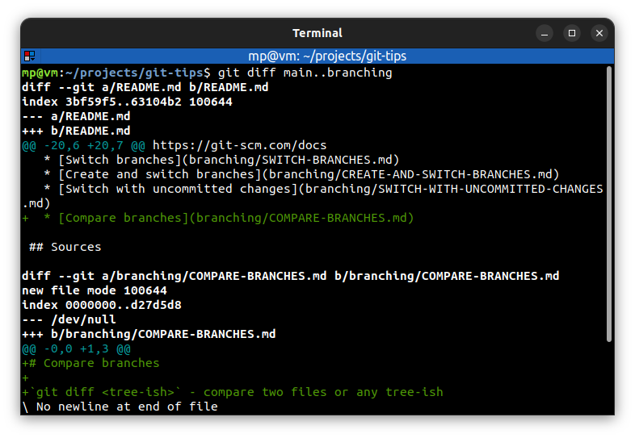
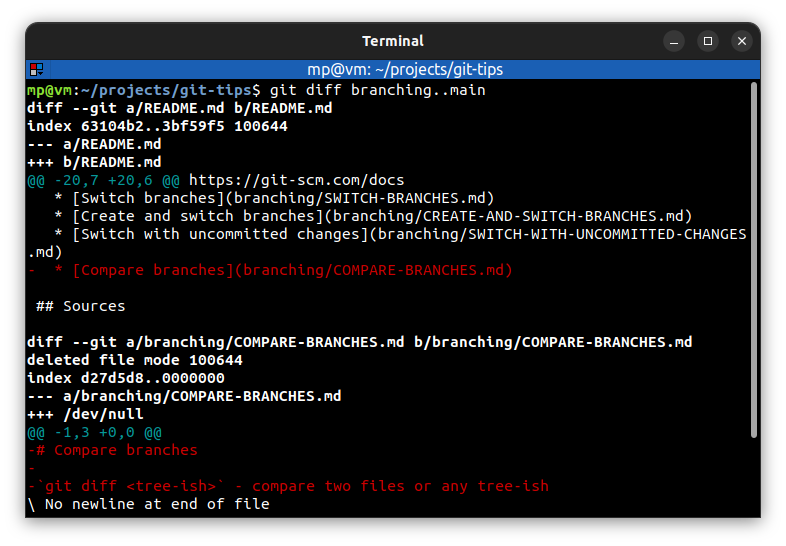
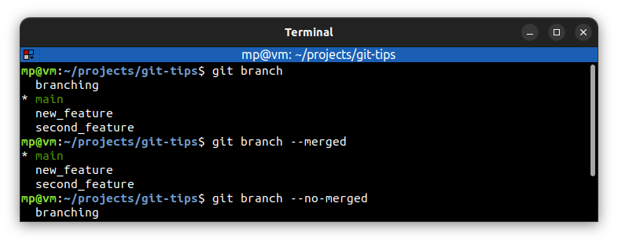

# Compare branches

`git diff <tree-ish>` - compare two files or any tree-ish

Typically, you put the older branch first during comparison. In the example below, `main` branch is older:

---
`git diff --color-words <tree-ish>` - **highlight changed words** using only colors (there are no `+`/`-`)

---
`git branch --merged` - only list branches whose tips **are reachable** from the specified commit. All the commits are in checked out branch.

`git branch --no-merged` - only list branches whose tips **are not reachable** from the specified commit. Not all the commits are in checked out branch.

Knowing which branches are fully included in another branch is very useful. Especially, when we start deleting branches.

