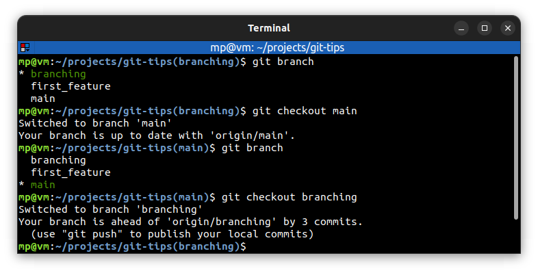

# Configure command prompt

**Git Prompt** - program which adds the **current branch name** to command prompt.

`__git_ps1` - check if git prompt is installed

## Installation

https://github.com/git/git/blob/master/contrib/completion/git-prompt.sh

## Configuration

`echo $PS1` - display current `PS1`. `PS1` stands for "**Prompt String One**", the first prompt string that you see at a command line

In `~/.bashrc` add `$(__git_ps1 "(%s)")` after `\w`:
```bash
export PS1='\[\e]0;\u@\h: \w\a\]${debian_chroot:+($debian_chroot)}\[\033[01;32m\]\u@\h\[\033[00m\]:\[\033[01;34m\]\w$(__git_ps1 "(%s)")\[\033[00m\]\$ '
```

or if Git Prompt has been installed manually:
```bash
if [ -f ~/.git-prompt.sh ]; then
  source ~/.git-prompt.sh
  export PS1='\[\e]0;\u@\h: \w\a\]${debian_chroot:+($debian_chroot)}\[\033[01;32m\]\u@\h\[\033[00m\]:\[\033[01;34m\]\w$(__git_ps1 "(%s)")\[\033[00m\]\$ '
fi
```

