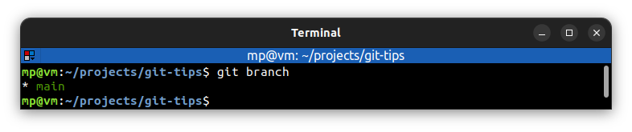
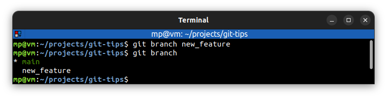

# Create branches

`git branch` - show a list of local branches

The default branch name in Git is **master** (in GitHub it is **main**)

Branch colored **green** means that this is currently checked out branch.

---

`git branch <branch>` - create `<branch>`

