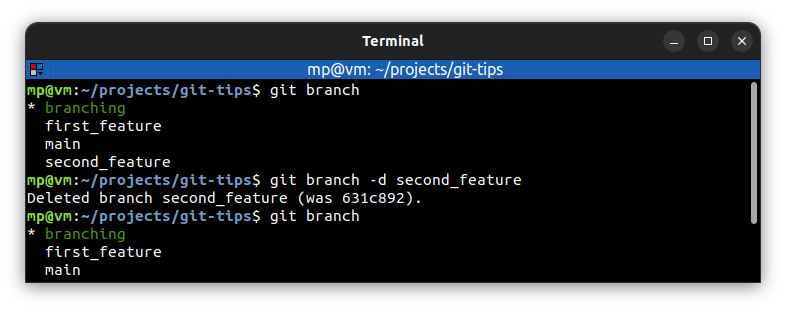
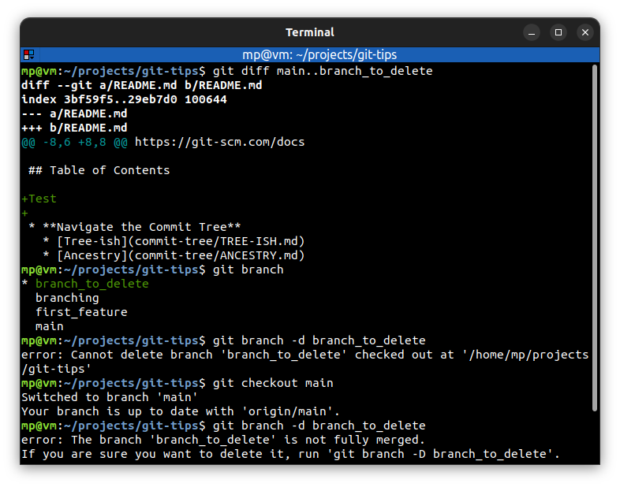
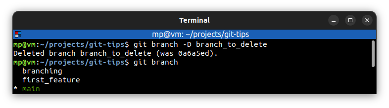

# Delete branches

`git branch -d <branch>` - delete `<branch>`

---
You can't delete checked out branch and branches which are not fully merged.

---
`git branch -D <branch>` - force delete `<branch>`

