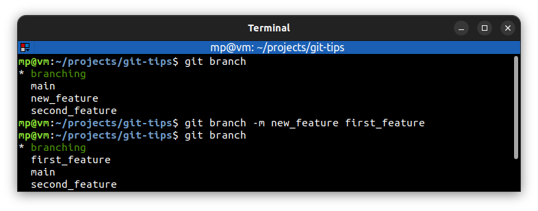

# Rename branches

`git branch -m [<oldBranchName>] <newBranchName>` or `git branch --move [<oldBranchName>] <newBranchName>` - rename (move) branch. Optionally you can provide `<oldBranchName>` if you're on **different branch**. When `<oldBranchName>` is not provided, you rename **current checked out branch**.

You don't want to start renaming your branches **if other people are already using them by another name**.