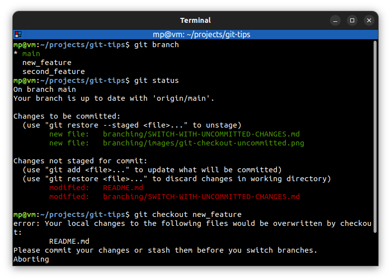

# Switch with uncommitted changes

You **cannot switch branches** if changes in working directory **conflict**.

However, you can switch if:
* changes in working directory could be applied **without conflict**
* files **are not being tracked**

If you have a conflict, you can:
* **commit** the changes to the current branch
* **remove** the changes
* **stash** the changes - stashes are like a little pocket where you can put the changes and pull them out when you're ready