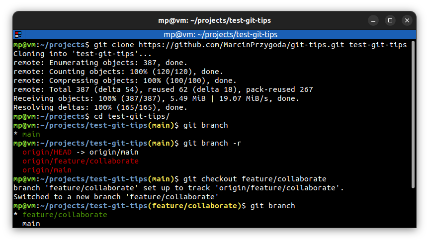

# ⭐ Checkout remote branches

When we clone the repository, git gives us only `main` branch **by default**.

You can checkout additional remote branches with:

| COMMAND                                      | DESCRIPTION                                                                                                                            |
| -------------------------------------------- | -------------------------------------------------------------------------------------------------------------------------------------- |
| `git branch <branch> <tracking-branch>`      | create new `<branch>` based on `<tracking-branch>`                                                                                     |
| `git checkout -b <branch> <tracking-branch>` | create new `<branch>` based on `<tracking-branch>` and checkout it                                                                     |
| `git checkout <branch>`                      | if `<branch>` does not exist and `<tracking-branch>` exists, then creates new `<branch>` based on `<tracking-branch>` and checkouts it |

## ⭐⭐ Examples

