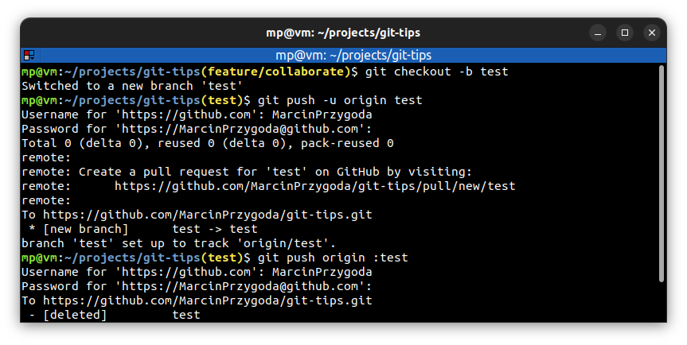
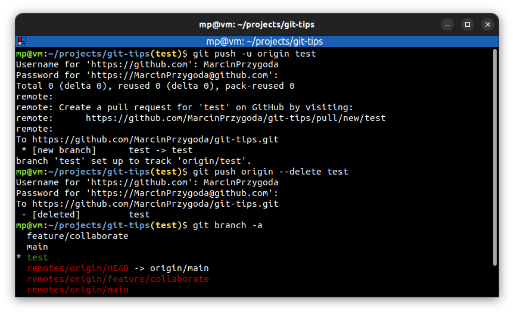

# ⭐ Delete a remote branch

| COMMAND                             | DESCRIPTION                                                                                                                                                                                                           |
| ----------------------------------- | --------------------------------------------------------------------------------------------------------------------------------------------------------------------------------------------------------------------- |
| `git push origin :<branch>`         | delete remote branch (local branch is not deleted). Regular push is doing `<branch>:<branch>` which is like "push `<branch>` to `<branch>`" The `:<branch>` is like "push nothing to `<branch>`". It's old style way. |
| `git push origin --delete <branch>` | improved way of deleting remote branch                                                                                                                                                                                |

## ⭐⭐ Examples

