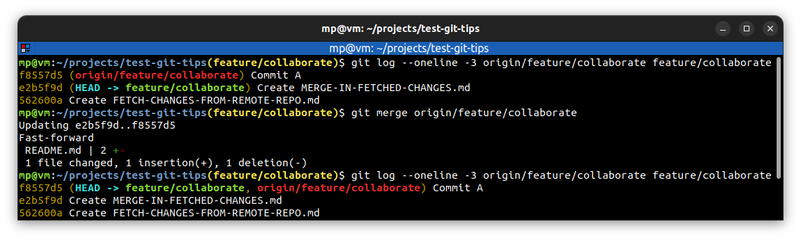

# ⭐ Merge in fetched changes

| COMMAND                       | DESCRIPTION                                                                            |
| ----------------------------- | -------------------------------------------------------------------------------------- |
| `git merge <tracking-branch>` | merge changes from `<tracking-branch>` into current local branch                       |
| `git merge`                   | when remote branch is tracked, you don't have to specify `<tracking-branch>` parameter |
| `git pull`                    | it is two-step operation: `git fetch` + `git merge`                                    |

## ⭐⭐ Examples

