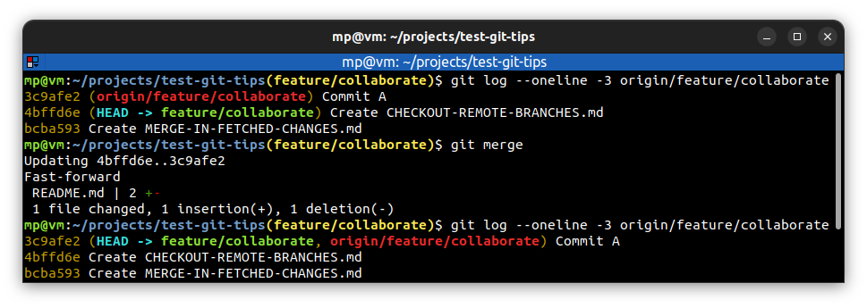

# ⭐ Merge in fetched changes

| COMMAND                       | DESCRIPTION                                                      |
| ----------------------------- | ---------------------------------------------------------------- |
| `git merge <tracking-branch>` | merge changes from `<tracking-branch>` into current local branch |
| `git pull`                    | it is two-step operation: `git fetch` + `git merge`              |

## ⭐⭐ Examples

