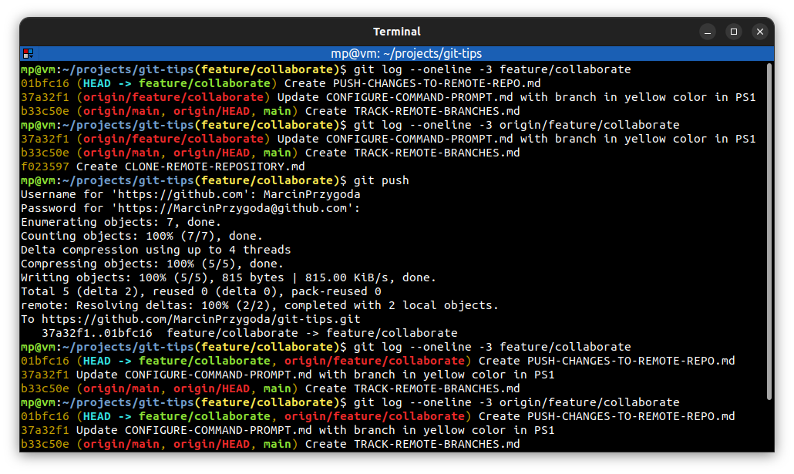

# ⭐ Push changes to a remote repository

| COMMAND                          | DESCRIPTION                                                                                                                          |
| -------------------------------- | ------------------------------------------------------------------------------------------------------------------------------------ |
| `git push <repository> <branch>` | push committed changes on `<branch>` into remote `<repository>`. The `-u` option is not needed when remote branch is already tracked |
| `git push`                       | when remote branch is tracked, you don't have to specify `<repository>` and `<branch>` parameters                                    |

## ⭐⭐ Examples

