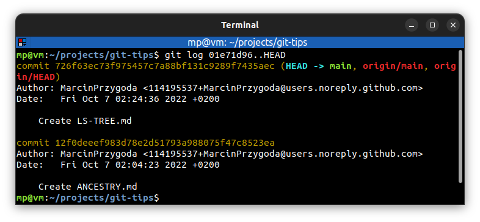

# Filter the Commit Log

`git log -3` - show last three commits:

---
`git log --since=2022-10-06` - show commits after given date

`git log --until=2022-10-06` - show commits before given date

**Other formats:**
* `git log --until="3 days ago"`
* `git log --after=2.weeks --before=3.days`

---
`git log --author="Marcin"` - show commits done by Marcin

---
`git log --grep="Initial"` - show commits that match the specified pattern

---
`git log 01e71d96..HEAD` - show commits in range

---
`git log commit-tree/TREE-ISH.md` - show commits related to a file or directory

