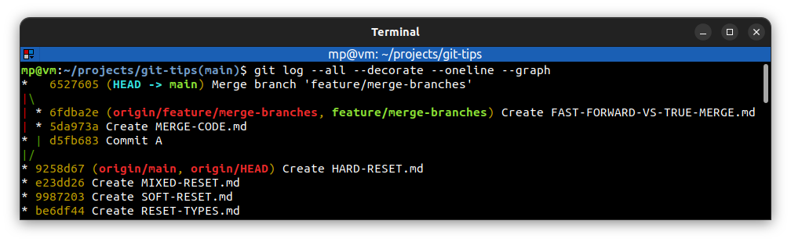

# Format the Commit Log

`git log -p` - show commits with a patch (changelist) information

---
`git log --stat` - show commits statistics

---
`git log --format=oneline` - show commits in different format

**Format options:**
* oneline
* short
* medium **(default)** - equivalent to `git log` command
* full
* fuller
* email
* raw

---
`git log --oneline` - show commits in one line with shorter SHA-1 hash

---
`git log --graph` - show commits graph

---
`git log --all --decorate --oneline --graph` - show commits graph of all branches in one line with decoration.

Think of the mnemonic `a dog` as a good way to remember this combo

