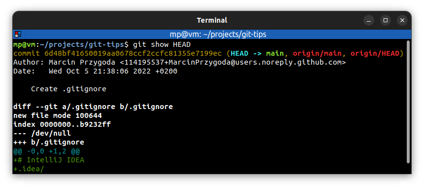

# Tree-ish

A **tree** in Git is a directory containing files and other directories.

Git uses the term **tree-ish** to refer to both trees and to identifiers which references a tree.

A commit is considered **tree-ish**, because it refers to a tree at the point when a commit has been applied.

In simple terms, a **tree-ish** is a **directory**, a **commit** or a **reference**.

**Most common references**:
* **SHA-1 hash:**
  * Complete 40-character string referencing a commit
  * We don't have to type all 40 characters: 4 or more are enough (usually 8-10 are used).
* **HEAD pointer reference:**
  * Reference to the tip of the current branch
  * It's similar to an analog tape recorder: it's where the play head is positioned for recording new commits
  * Usually it points to the commit that you made last, but it can be moved around
  * Git keeps track of where the head is pointed by using some files in `.git/HEAD` which usually refers to something else e.g. `.git/refs/heads/main` (when we're on `main` branch) which contains SHA-1 hash
* **Branch reference**
* **Tag reference**
* **[Ancestry](ANCESTRY.md)**

## Examples

`git log` - show commit logs:

`git show` - show various types of objects. For commits, it shows the log message and textual diff.

We can use `git show` with **SHA-1 hash** (`git show 6d48` will also work):

We also can use `git show` with **HEAD pointer reference**

