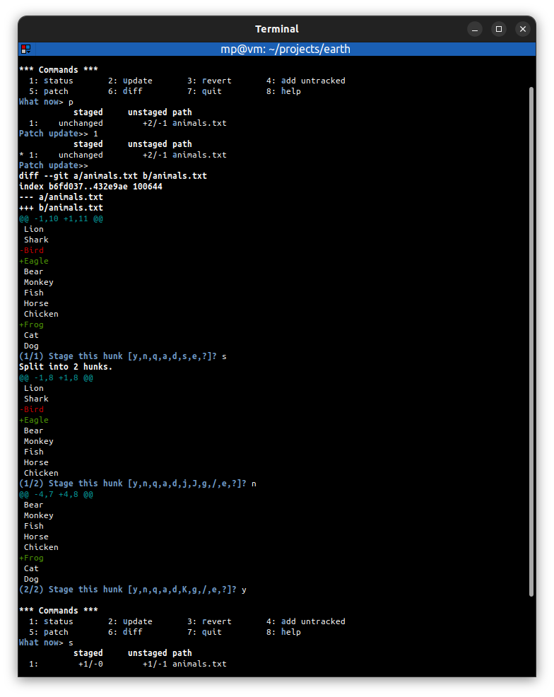
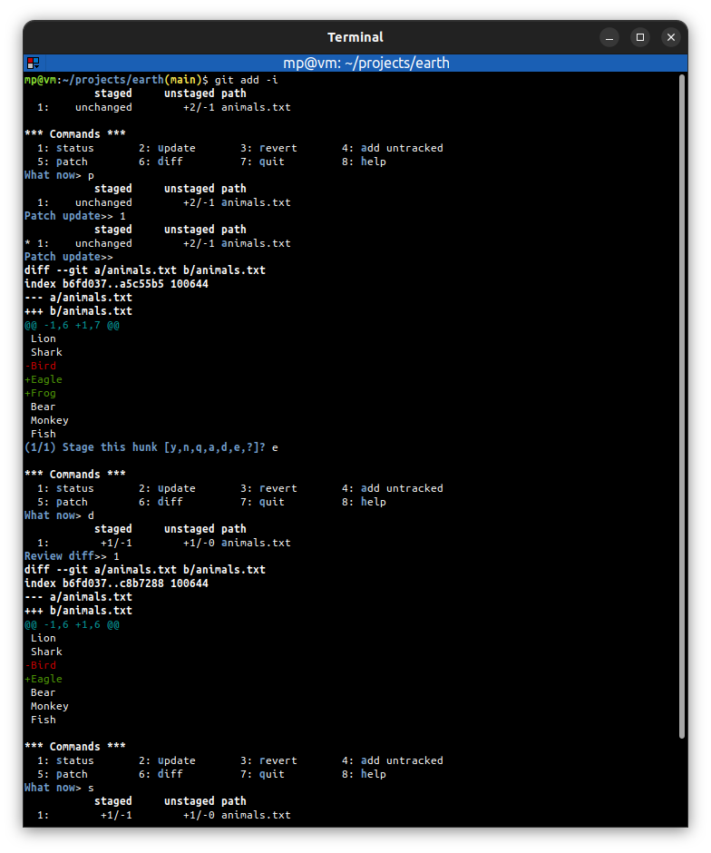

# 📋 `git add` - add file contents to the staging index

| COMMAND             | DESCRIPTION                                                                                      |
| ------------------- | ------------------------------------------------------------------------------------------------ |
| `git add <file>...` | add files to the staging index [🔗](#add-a-file-to-the-staging-index)                             |
| `git add .`         | add all files in current directory to the staging index [🔗](#add-all-files-to-the-staging-index) |

| OPTION                    | DESCRIPTION                                                                                                 |
| ------------------------- | ----------------------------------------------------------------------------------------------------------- |
| `-i` `--interactive` | enter staging in interactive mode [🔗](#run-staging-in-interactive-mode)                                     |
| `-p` `--patch`       | enter staging in patch mode (shortcut to patch mode in interactive staging) [🔗](#run-staging-in-patch-mode) |

## 📌 Untracked file

**Untracked file** is a file that have been created within working directory but have not yet been added to the **staging index** using the `git add` command. It means that changes done in untracked file are **not tracked** by Git.

## 📌 Interactive staging

Interactive staging enters an **interface** that allows to **move files** or **portions of changed files** in and out of staging index.

## 📌 Examples

### Add a file to the staging index

### Add all files to the staging index

### Run staging in interactive mode

Interactive update (add to staging):

Interactive revert (remove from staging):

Interactively add untracked files:

Interactive diff between HEAD and staging index:

Interactive patch (stage portions (hunks) of a changed file):

Interactive patch with splitting hunks:

Interactive patch with editing hunks:

Interactive patch help:

## Run staging in patch mode

