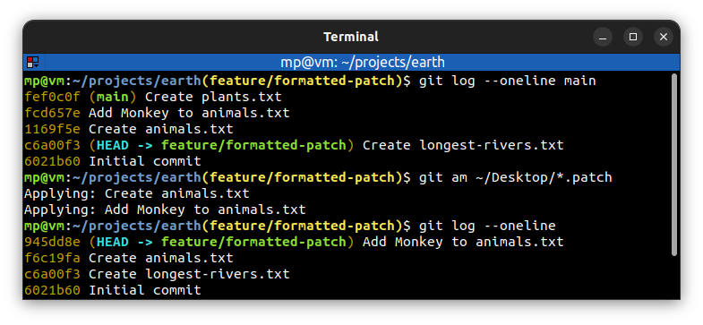
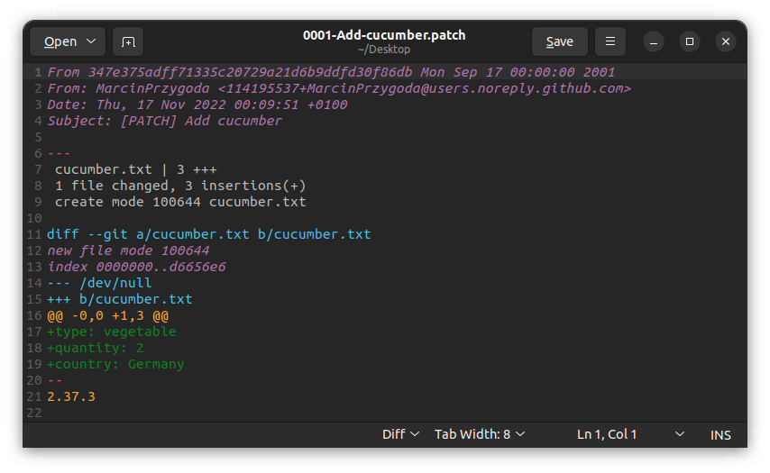

# 📋 `git am` - apply a series of patches from a mailbox

**Formatted patches** can be created by [`git format-patch`](GIT-FORMAT-PATCH.md) command.

| COMMAND                  | DESCRIPTION                                          |
| ------------------------ | ---------------------------------------------------- |
| `git am <file.patch>...` | apply patches in Unix mailbox format and commit them |

## 📌 Examples

