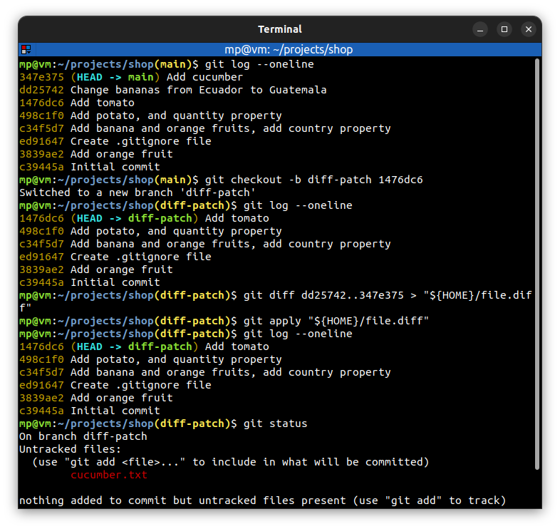
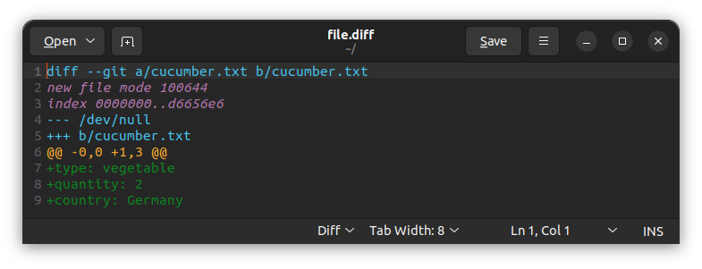

# 📋 `git apply` - apply a patch to files and/or to the staging index

**Patches** can be created by [`git diff`](GIT-DIFF.md) command.

| COMMAND                 | DESCRIPTION                                           |
| ----------------------- | ----------------------------------------------------- |
| `git apply <file.diff>` | apply a patch from `<file.diff>` to working directory |

## 📌 Example

