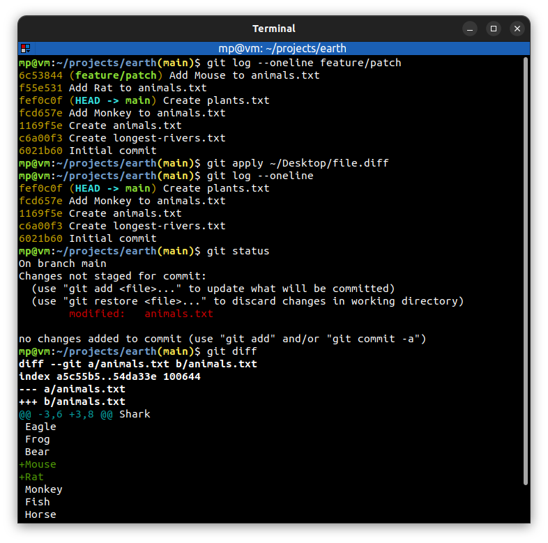

# 📋 `git apply` - apply a patch to files and/or to the staging index

| COMMAND                    | DESCRIPTION                                                          |
| -------------------------- | -------------------------------------------------------------------- |
| `git apply <file.diff>...` | apply patches from diff files to working directory [🔗](#apply-patch) |

## 📌 How to create patches?

**Patches** can be created by [`git diff`](GIT-DIFF.md) command.

## 📌 Example

### Apply patch

