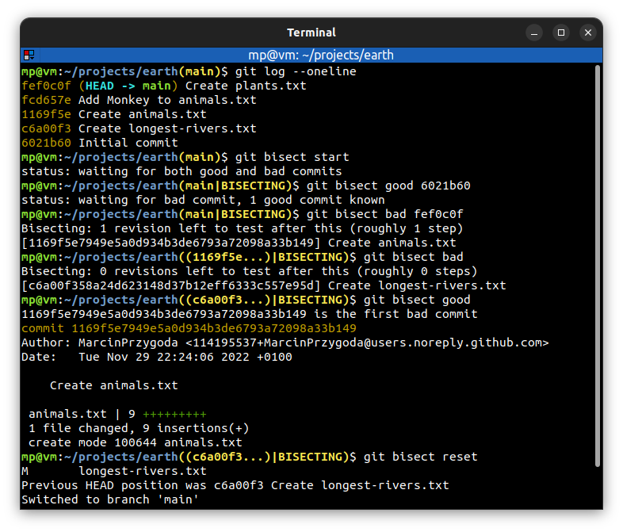

# 📋 `git bisect` - use binary search to find the commit that introduced a bug

| COMMAND                      | DESCRIPTION                                                |
| ---------------------------- | ---------------------------------------------------------- |
| `git bisect start`           | start `bisect` session [🔗](#execute-git-bisect)            |
| `git bisect good <tree-ish>` | mark `tree-ish` as good revision                           |
| `git bisect bad <tree-ish>`  | mark `tree-ish` as bad revision                            |
| `git bisect reset`           | exit `bisect` session (resets working directory to `HEAD`) |

## 📌 How `git bisect` works?

Bisect needs **last known good revision** and **first known bad revision**. Then git will **automate** a process to help you figure out where in **between those** a bug was introduced.

Bisect checkouts code at **mid-point** where you can mark revision as good or bad after performing some tests. When you decide if revision is good or bad, then bisect will checkout code at **next mid-point** and so on.

## 📌 Example

### Execute `git bisect`

