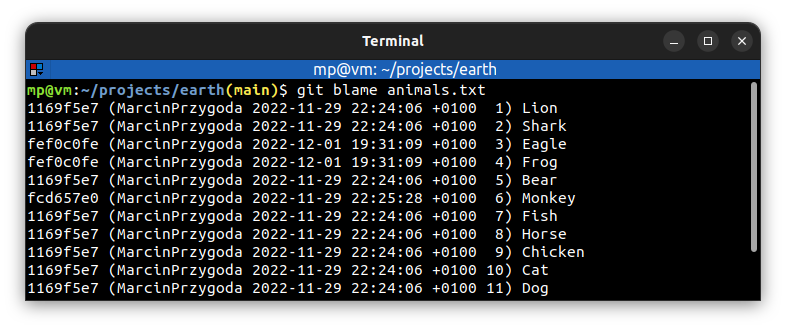
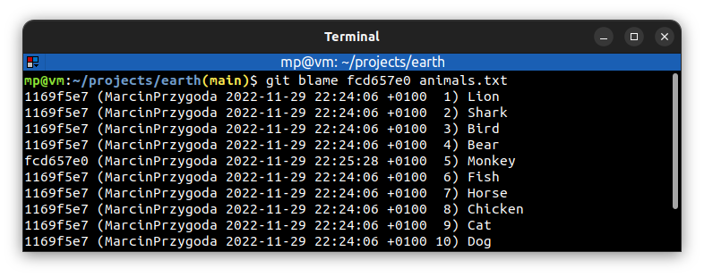
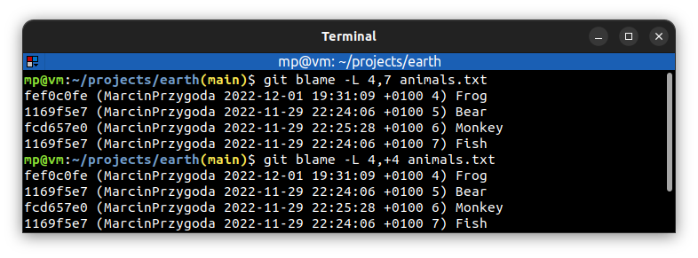

# 📋 `git blame` - show what revision and author last modified each line of a file

| COMMAND                     | DESCRIPTION                                                                                               |
| --------------------------- | --------------------------------------------------------------------------------------------------------- |
| `git blame <file>`          | annotate `<file>`, so you can determine who changed which lines in a `<file>` and why [🔗](#annotate-file) |
| `git blame <commit> <file>` | annotate `<file>` at `<commit>` revision [🔗](#annotate-file-at-revision)                                  |

| OPTION                         | DESCRIPTION                                                                   |
| ------------------------------ | ----------------------------------------------------------------------------- |
| `-w`                           | ignore changes done to whitespace                                             |
| `-L 100,150` `-L 100,+51` | annotate only lines 100-150 of the `<file>` [🔗](#annotate-line-range-in-file) |

## 📌 Examples

### Annotate file

### Annotate file at revision

### Annotate line range in file

