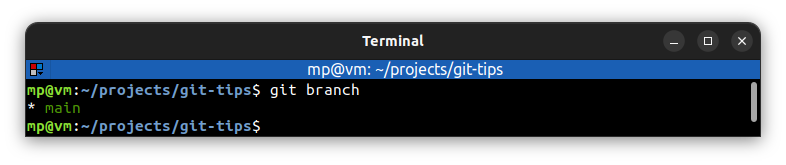
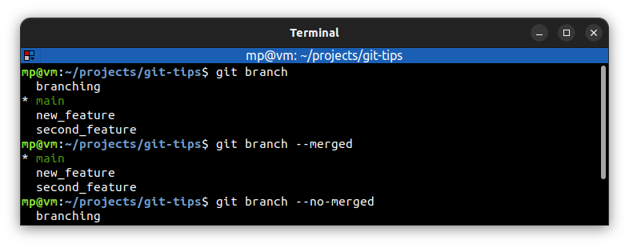
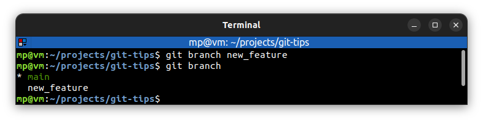
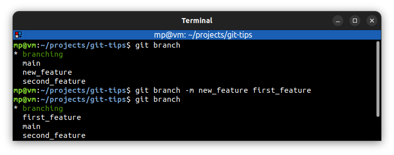
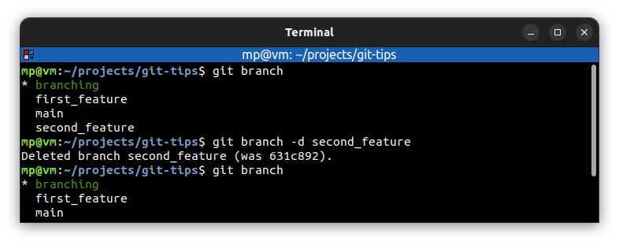
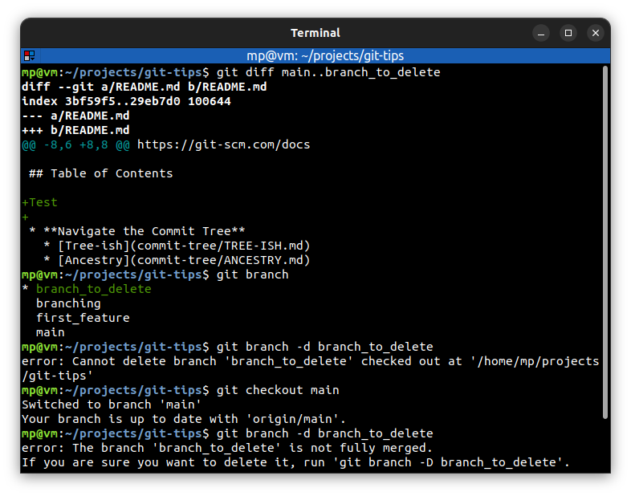
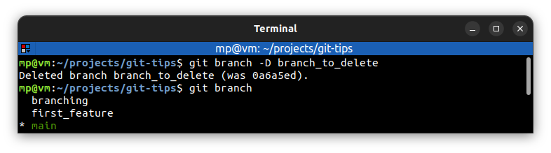

# 📋 `git branch`

The default branch name in Git is **master** (in GitHub it is **main**).

| COMMAND                                   | DESCRIPTION                                                                                                                                            |
| ----------------------------------------- | ------------------------------------------------------------------------------------------------------------------------------------------------------ |
| `git branch`                              | list local branches [🔗](#list-local-branches)                                                                                                          |
| `git branch --merged`                     | list only branches whose tips **are reachable** from the specified commit. All the commits are in checked out branch [🔗](#merged-vs-no-merged)         |
| `git branch --no-merged`                  | list only branches whose tips **are not reachable** from the specified commit. Not all the commits are in checked out branch [🔗](#merged-vs-no-merged) |
| `git branch -r`                           | list remote branches                                                                                                                                   |
| `git branch -a`                           | list both local and remote branches                                                                                                                    |
| `git branch <branch>`                     | create local `<branch>` [🔗](#create-local-branch)                                                                                                      |
| `git branch -m <new-branch>`              | rename (move) current branch to `<new-branch>` [🔗](#rename-current-branch)                                                                             |
| `git branch -m <old-branch> <new-branch>` | rename (move) `<old-branch>` to `<new-branch>`                                                                                                         |
| `git branch -d <branch>`                  | delete `<branch>` [🔗](#delete-branch)                                                                                                                  |
| `git branch -D <branch>`                  | force delete `<branch>` [🔗](#force-delete-branch)                                                                                                      |
| `git branch -u <upstream> <branch>`       | set `<upstream>` ([**tracking**](../terms/TRACK-REMOTE-BRANCHES.md)) reference for `<branch>`                                                          |
| `git branch --unset-upstream <branch>`    | unset upstream ([**tracking**](../terms/TRACK-REMOTE-BRANCHES.md)) reference for `<branch>`                                                            |

## 📌 Renaming branches

You don't want to start renaming your branches **if other people are already using them by another name**.

## 📌 Deleting branches

You can't delete checked out branch and branches which are not fully merged [🔗](#delete-checked-out-branch)

## 📌 Example

Branch colored **green** means that this is checked out branch.

### List local branches

### Merged vs no merged

Knowing which branches are fully included in another branch is very useful. Especially, when we start deleting branches:

### Create local branch

### Rename current branch

### Delete branch

### Delete checked out branch

### Force delete branch

