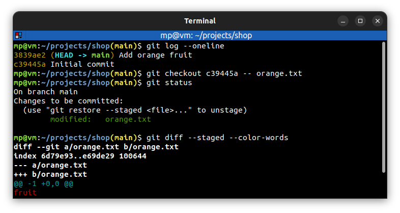

# 📋 `git checkout` - switch branches or restore working directory files

| COMMAND                                      | DESCRIPTION                                                                                                                                |
| -------------------------------------------- | ------------------------------------------------------------------------------------------------------------------------------------------ |
| `git checkout <tree-ish>`                    | switch to any tree-ish e.g. branch, commit or tag [🔗](#switch-to-branch)                                                                   |
| `git checkout -b <new-branch>`               | create `<new-branch>` branch from current branch and switch to it [🔗](#create-and-switch-to-branch)                                        |
| `git checkout -b <new-branch> <start-point>` | create `<new-branch>` branch from `<start-point>` branch and switch to it                                                                  |
| `git checkout <commit> -- <file>`            | checkout old version of `<file>`: from `<commit>` on current branch (`--`), and add it to staging index [🔗](#checkout-old-version-of-file) |

## 📌 Switch with uncommitted changes

You **cannot switch branches** if changes in working directory **conflict** [🔗](#switch-with-uncommitted-changes)

However, you can switch if:
- changes in working directory could be applied **without conflict**
- files **are not being tracked**

If you have a conflict, you can:
- **commit** the changes to the current branch
- **remove** the changes
- **stash** the changes - stashes are like a **little pocket** where you can put the changes and pull them out when you're ready

## 📌 Example

### Switch to branch

### Create and switch to branch

### Switch with uncommitted changes

### Checkout old version of file

