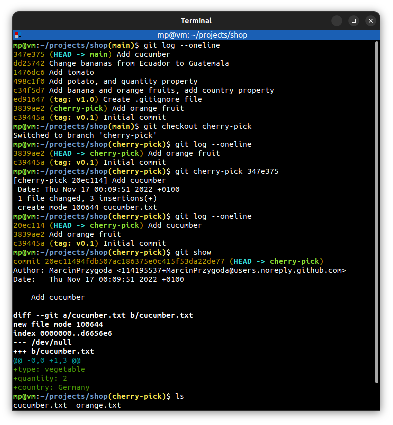
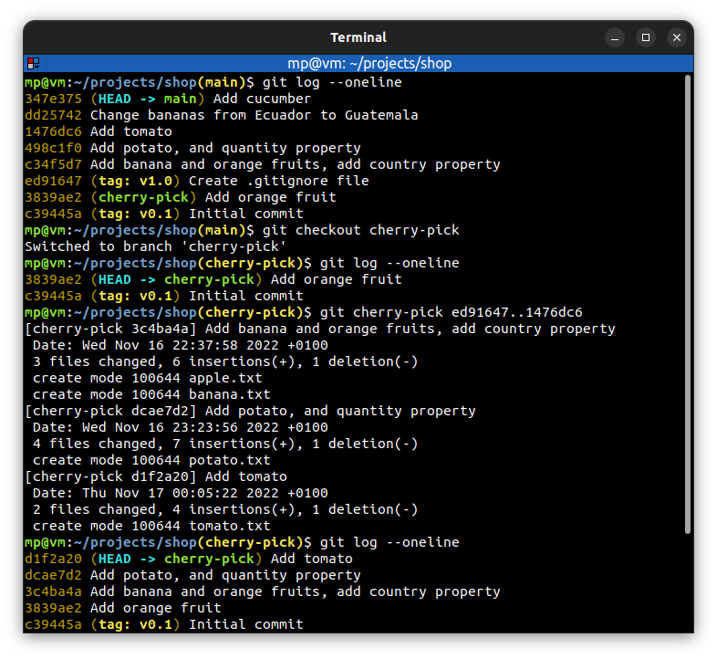
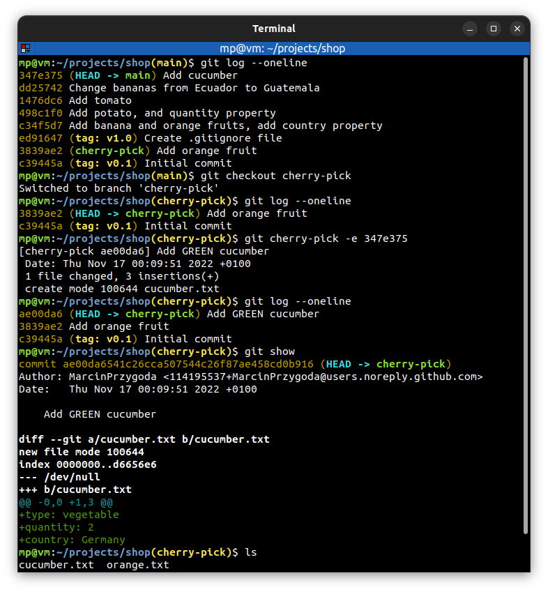

# 📋 `git cherry-pick` - apply the changes introduced by some existing commits

| COMMAND                              | DESCRIPTION                                                         |
| ------------------------------------ | ------------------------------------------------------------------- |
| `git cherry-pick <commit>`           | cherry-pick a `<commit>` [🔗](#cherry-pick-a-commit)                 |
| `git cherry-pick <commit>..<commit>` | cherry-pick a range of commits [🔗](#cherry-pick-a-range-of-commits) |

| OPTION                                                               | DESCRIPTION                                                                                         |
| -------------------------------------------------------------------- | --------------------------------------------------------------------------------------------------- |
| `-e` `--edit` | cherry-pick a `<commit>` and edit commit message [🔗](#cherry-pick-a-commit-and-edit-commit-message) |

## 📌 Cherry-picking commits

**Cherry-picking** means that we apply the changes from one or more **existing commits**. Each existing commit is recorded as **a new commit** on the current branch.

It is conceptually similar to **copy-paste operation**. However, new commits have **different** SHA-1 hash.

You can cherry-pick commits from any branch that is **visible** to you. However, you cannot cherry-pick **a merge commit**.

## 📌 Conflicts when cherry-picking

When you `cherry-pick` a commit, it's possible for it to **have conflicts**. And if you do have conflicts, it will work just like [merge conflicts](../concepts/MERGE-CONFLICTS.md) do.

## 📌 Examples

### Cherry-pick a commit

### Cherry-pick a range of commits

### Cherry-pick a commit and edit commit message

