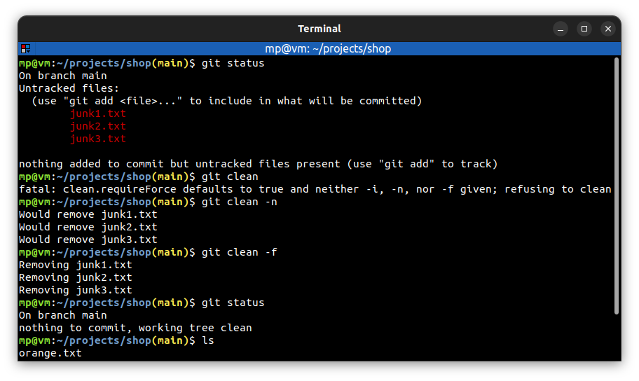

# 📋 `git clean` - remove untracked files from the working directory

| COMMAND                                   | DESCRIPTION                                                                                                                                                                              |
| ----------------------------------------- | ---------------------------------------------------------------------------------------------------------------------------------------------------------------------------------------- |
| `git clean -n` `git clean --dry-run` | don’t actually remove anything, just show what would be done                                                                                                                             |
| `git clean -d`                            | normally, when no `<path>` is specified, git clean will not recurse into untracked directories to avoid removing too much. Specify `-d` to have it recurse into such directories as well |
| `git clean -f` `git clean --force`   | if the Git configuration variable `clean.requireForce` is not set to `false`, git clean will refuse to delete files or directories unless given `-f`                                     |
| `git clean -x`                            | normally, only files unknown to Git are removed, but if the `-x` option is specified, ignored files are also removed                                                                     |
| `git clean -X`                            | remove only files ignored by Git. This may be useful to rebuild everything from scratch, but keep manually created files                                                                 |

## 📌 Example

