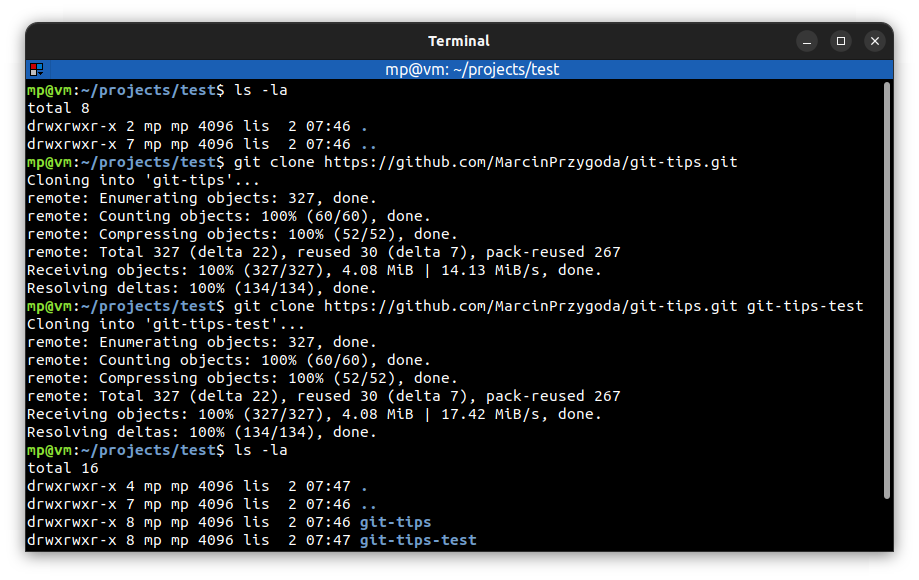

# 📋 `git clone` - clone a repository into a new directory

| COMMAND                 | DESCRIPTION                                                                                                                                                 |
| ----------------------- | ----------------------------------------------------------------------------------------------------------------------------------------------------------- |
| `git clone <url> <dir>` | clone (copy) remote Git repository from `<url>` into local `<dir>`. If `<dir>` is not provided, repository is cloned under directory having repository name |

## 📌 Example

