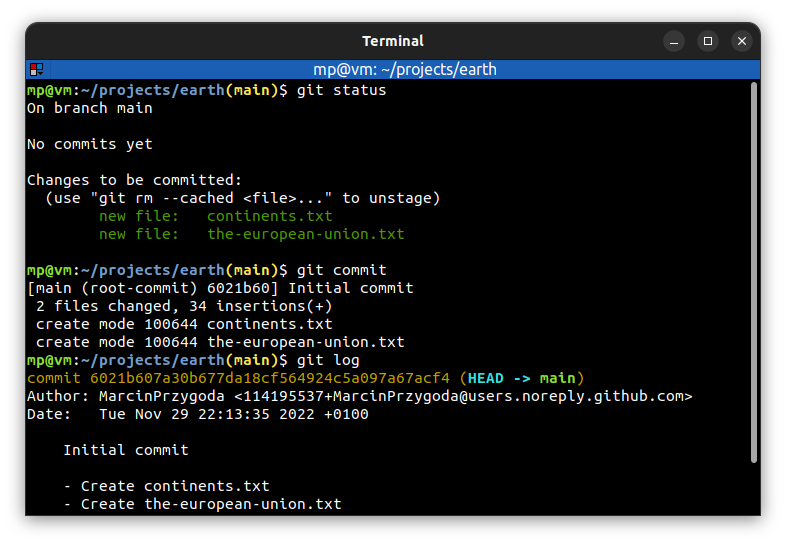
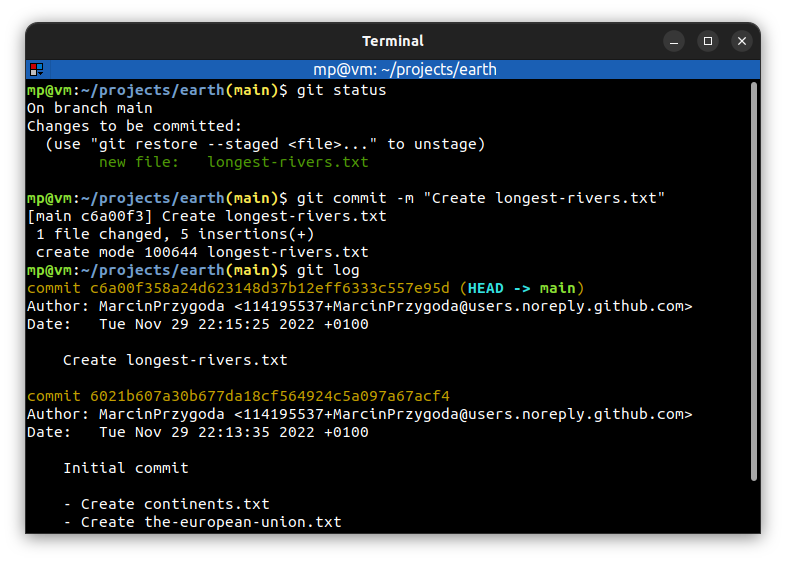
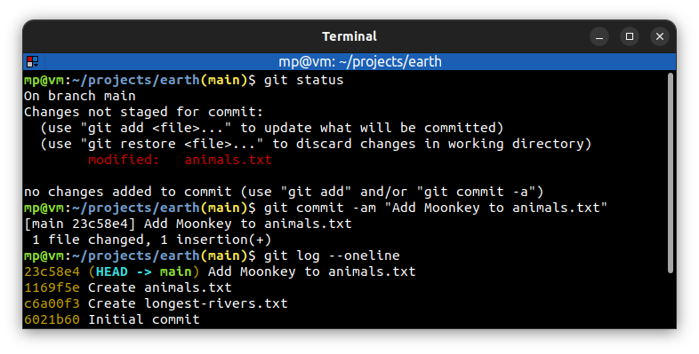
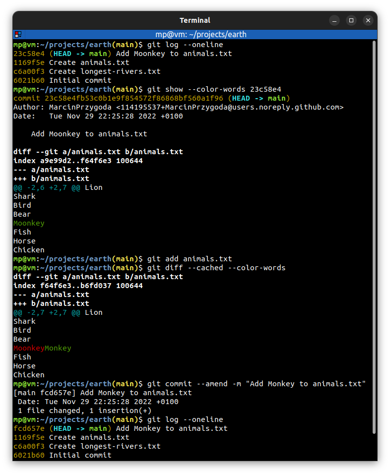

# 📋 `git commit` - record changes to the repository

| COMMAND      | DESCRIPTION                                                                                                                                                       |
| ------------ | ----------------------------------------------------------------------------------------------------------------------------------------------------------------- |
| `git commit` | create a new commit containing the current contents of the staging index and multiline message describing the changes [🔗](#commit-changes-with-multiline-message) |

| OPTION                                        | DESCRIPTION                                                                                                                                         |
| --------------------------------------------- | --------------------------------------------------------------------------------------------------------------------------------------------------- |
| `-a` `--all`                             | automatically stage tracked files that have been modified/deleted and create a new commit [🔗](#automatically-stage-tracked-file-and-commit-changes) |
| `--amend`                                     | replace the tip of the current branch by creating a new commit [🔗](#amend-commit)                                                                   |
| `-m "<message>"` `--message "<message>"` | create a new commit with one line `<message>` [🔗](#commit-changes-with-one-line-message)                                                            |

## 📌 Commit message best practices

- A short **single-line summary** (max **72** characters)
- Optionally followed by a **blank line** and a more complete description
- Keep **each line** at max **72** characters (in case of multiline commit messages)
- Write commit messages in **present tense**, not past tense. They are labels for what's inside a commit
- Bullet points are usually **asterisks** `*` or **hyphens** `-`
- You can add **tracking numbers** from bugs or support requests
- Be **clear** and **descriptive**

## 📌 No commit message

When Git is not provided a commit message, it will **abort the commit**. Using the `-m` option with empty quotes has the same result as exiting a text editor without providing a message.

## 📌 Atomic commit

- **small** commit
- only affect **a single aspect** (relate to one thing)
- **easier** to understand, to work with and to find bugs
- **improves** collaboration

## 📌 Examples

### Commit changes with multiline message

### Commit changes with one line message

### Automatically stage tracked file and commit changes

### Amend commit

