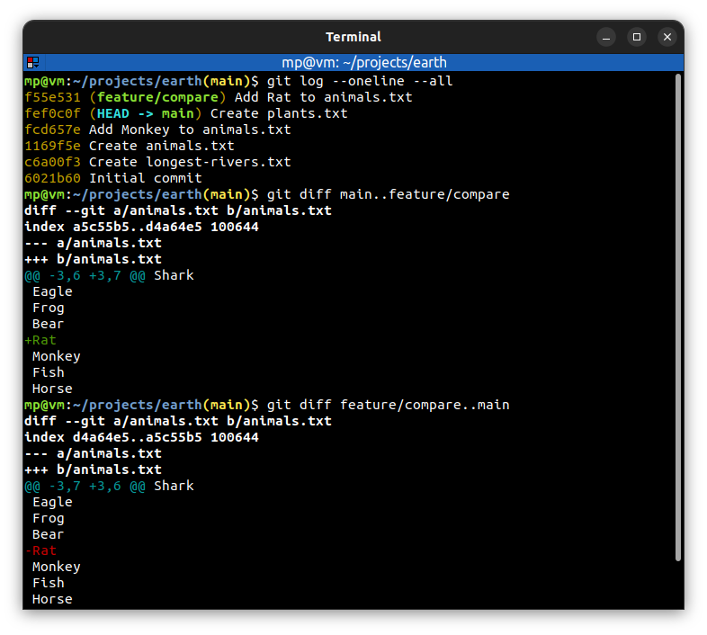
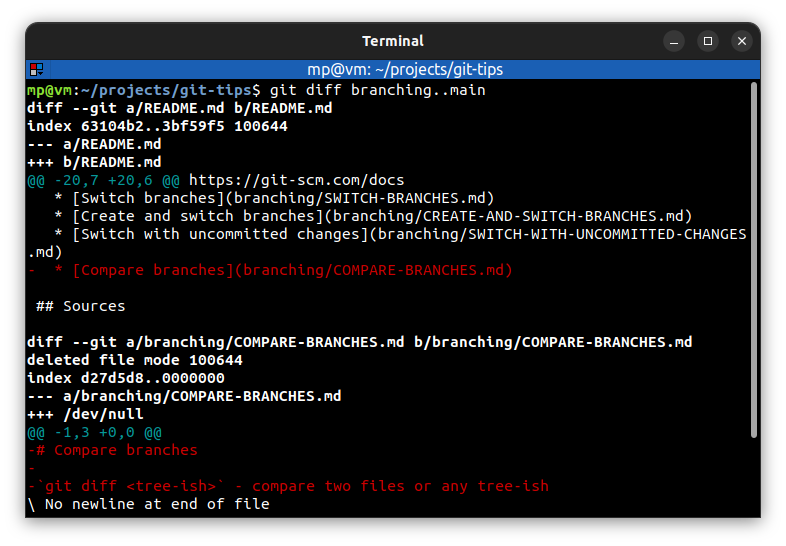

# 📋 `git diff` - show changes between commits, commit and working directory, etc

| COMMAND                                       | DESCRIPTION                                                                 |
| --------------------------------------------- | --------------------------------------------------------------------------- |
| `git diff`                                    | compare working directory against staging index                             |
| `git diff --staged` `git diff --cached`  | compare staging index against repository                                    |
| `git diff <tree-ish>..<tree-ish>`             | compare two files or any tree-ish [🔗](#comparing-branches)                  |
| `git diff <tree-ish>..<tree-ish> > file.diff` | create a patch file. You can then apply it with [`git apply`](GIT-APPLY.md) |
| `git diff --color-words <tree-ish>`           | **highlight changed words** using only colors (there are no `+`/`-`)        |

## 📌 Example

### Comparing branches

Typically, you put the older branch first during comparison.

In the example below, `main` branch is older:

