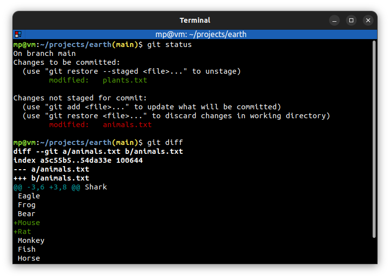
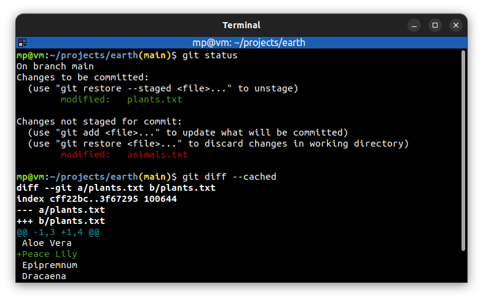
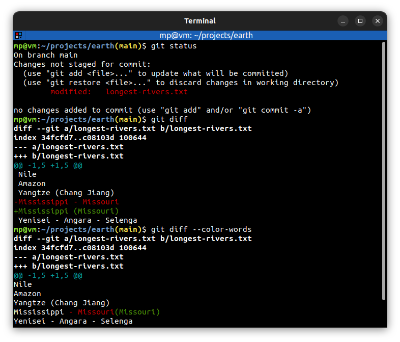
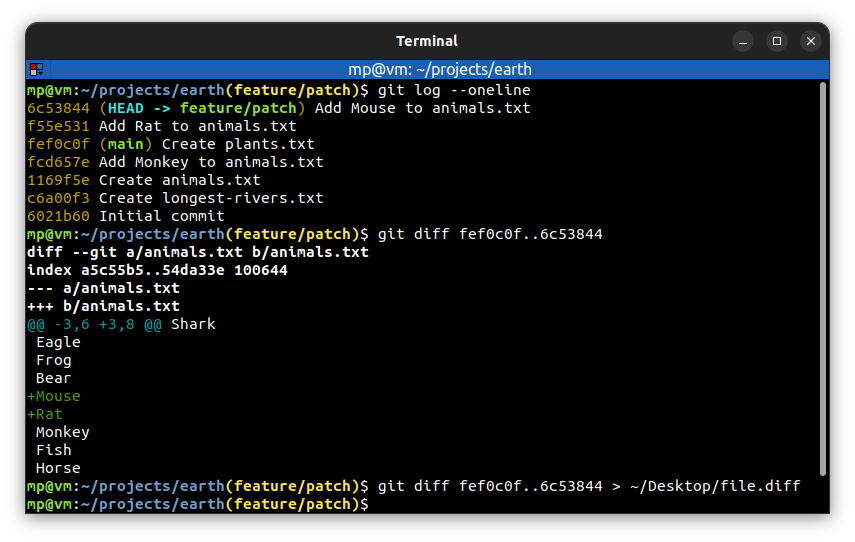
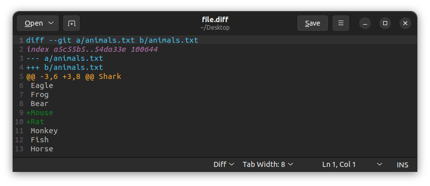

# 📋 `git diff` - show changes between commits, commit and working directory, etc

| COMMAND                                       | DESCRIPTION                                                                                            |
| --------------------------------------------- | ------------------------------------------------------------------------------------------------------ |
| `git diff`                                    | compare working directory against staging index [🔗](#compare-working-directory-against-staging-index)  |
| `git diff <tree-ish>..<tree-ish>`             | compare two files or any tree-ish [🔗](#compare-branches)                                               |
| `git diff <tree-ish>..<tree-ish> > file.diff` | create a patch file. You can then apply it with [`git apply`](GIT-APPLY.md) command [🔗](#create-patch) |

| OPTION                     | DESCRIPTION                                                                                    |
| -------------------------- | ---------------------------------------------------------------------------------------------- |
| `--cached` `--staged` | compare staging index against repository [🔗](#compare-staging-index-against-repository)        |
| `--color-words`            | highlight changed words using only colors (there are no `+`/`-`) [🔗](#highlight-changed-words) |

## 📌 Example

### Compare working directory against staging index

### Compare staging index against repository

### Compare branches

Typically, you put the older branch first during comparison.

In the example below, `main` branch is older:

### Highlight changed words

### Create patch

### Patch file

