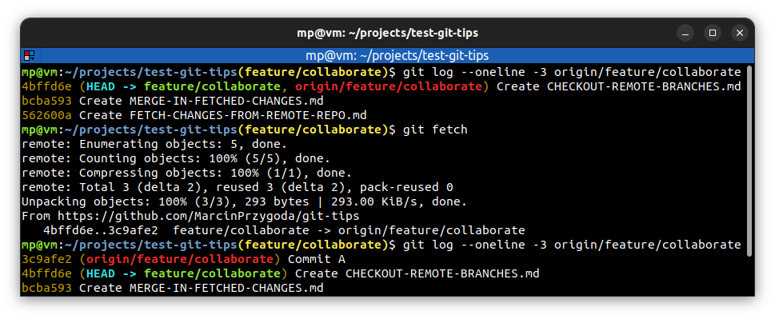

# 📋 `git fetch`

Fetch is basically just checking with a remote server to make sure that you have **all the information** about what's on that remote server. It **doesn't merge** anything into your existing branches.

You should:
- fetch **before you start work everyday**
- fetch **before you push**
- fetch **before you go offline** (so you can continue work without Internet access)
- fetch **often**

| COMMAND                  | DESCRIPTION                                                                                                                                                                         |
| ------------------------ | ----------------------------------------------------------------------------------------------------------------------------------------------------------------------------------- |
| `git fetch <repository>` | fetch branches and/or tags (collectively, "refs") from one or more repositories, along with the objects necessary to complete their histories. Remote-tracking branches are updated |
| `git fetch`              | when remote branch is tracked, you don't have to specify `<repository>` parameter                                                                                                   |

## 📌 Example

