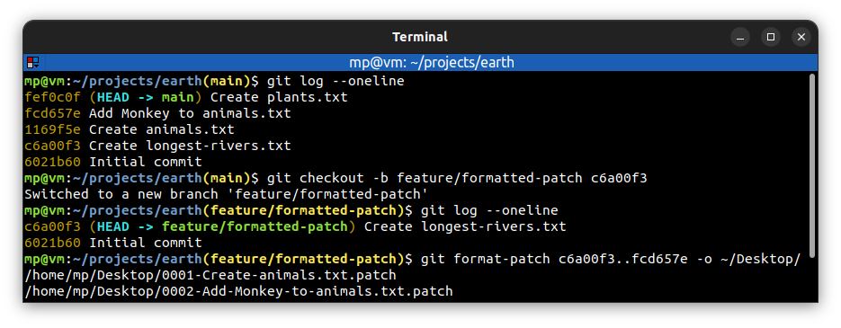
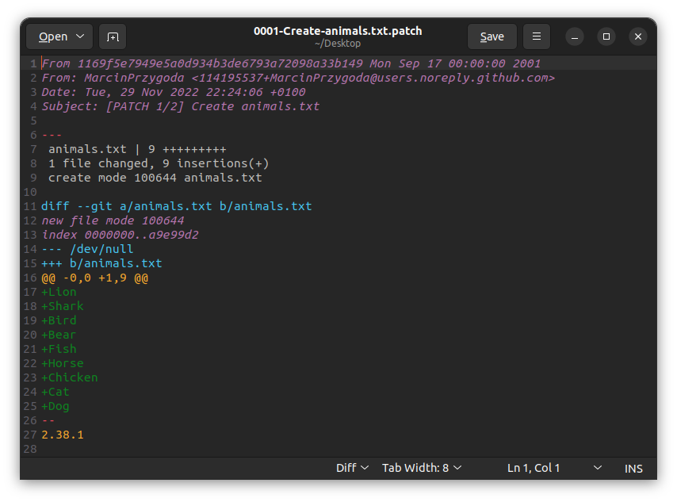

# 📋 `git format-patch` - prepare formatted patches for e-mail submission

| COMMAND                                                       | DESCRIPTION                                                                                                                                                                                         |
| ------------------------------------------------------------- | --------------------------------------------------------------------------------------------------------------------------------------------------------------------------------------------------- |
| `git format-patch <commit>..<commit>`                         | export all commits in the range in Unix mailbox format into current directory, which is useful for e-mail distribution of changes. For each commit one file is created [🔗](#create-formatted-patch) |
| `git format-patch <commit>..<commit> --stdout > <file.patch>` | export all commits in the range as a single file                                                                                                                                                    |
| `git format-patch -1 <commit>`                                | export a single commit into current directory                                                                                                                                                       |
| `git format-patch <branch>`                                   | export all commits on current branch which are not in `<branch>` into current directory                                                                                                             |

| OPTION                                     | DESCRIPTION                                                |
| ------------------------------------------ | ---------------------------------------------------------- |
| `-o <dir>` `--output-directory <dir>` | export into `<dir>` directory [🔗](#create-formatted-patch) |

## 📌 How to apply formatted patches?

Formatted patches can be applied by [`git am`](GIT-AM.md) command.

## 📌 Examples

### Create formatted patch

### Formatted patch file

