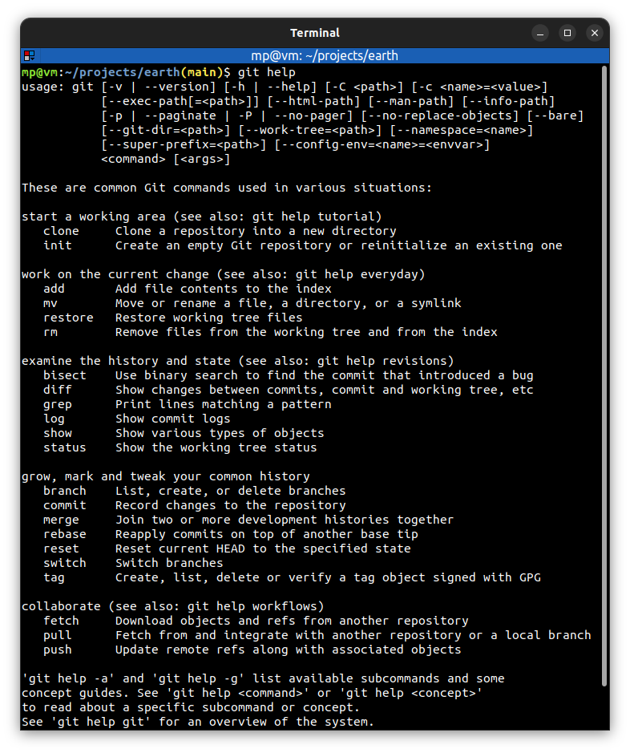

# 📋 `git help` - display help information about Git

| COMMAND                                        | DESCRIPTION                   |
| ---------------------------------------------- | ----------------------------- |
| `git help`                                     | list available commands       |
| `git help -a`                                  | list available subcommands    |
| `git help -g`                                  | list concept guides           |
| `git help <command>` or `git <command> --help` | show help for the `<command>` |
| `git help <concept>`                           | show help for the `<concept>` |

## 📌 Example

