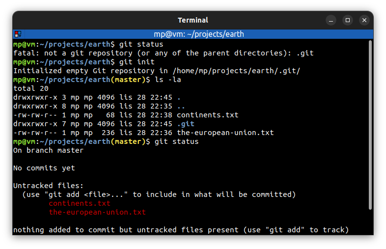
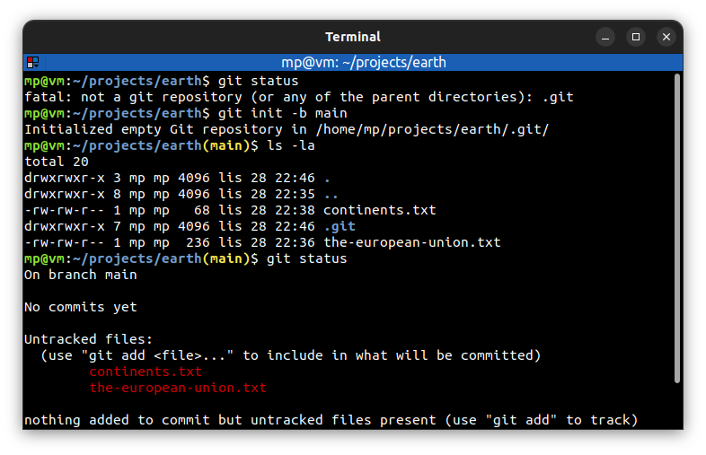

# 📋 `git init` - create an empty Git repository or reinitialize an existing

| COMMAND    | DESCRIPTION                                                                                                            |
| ---------- | ---------------------------------------------------------------------------------------------------------------------- |
| `git init` | initialize local Git repository (creates a `.git` directory with subdirectories) [🔗](#initialize-local-git-repository) |

| OPTION                                         | DESCRIPTION                                                                                                             |
| ---------------------------------------------- | ----------------------------------------------------------------------------------------------------------------------- |
| `-b <branch>` `--initial-branch <branch>` | initialize local Git repository with given `<branch>` name [🔗](#initialize-local-git-repository-with-given-branch-name) |

## 📌 Initializing existing repository

Running `git init` in an **existing repository** is **safe**. It will not overwrite things that are already there.

## 📌 Example

### Initialize local Git repository

### Initialize local Git repository with given branch name

