# 📋 `git log` - show commit logs

| COMMAND   | DESCRIPTION      |
| --------- | ---------------- |
| `git log` | show all commits |

## 📌 Filtering Git Log

| COMMAND                           | DESCRIPTION                                                                                                               |
| --------------------------------- | ------------------------------------------------------------------------------------------------------------------------- |
| `git log -3`                      | show last three commits [🔗](#show-last-three-commits)                                                                     |
| `git log --since=2022-10-06`      | show commits after given date (see [other date formats below](#other-date-formats)) [🔗](#show-commits-after-given-date)   |
| `git log --until=2022-10-06`      | show commits before given date (see [other date formats below](#other-date-formats)) [🔗](#show-commits-before-given-date) |
| `git log --author="Marcin"`       | show commits done by someone [🔗](#show-commits-done-by-someone)                                                           |
| `git log --grep="Initial"`        | show commits that match the specified pattern [🔗](#show-commits-that-match-the-specified-pattern)                         |
| `git log 01e71d96..HEAD`          | show commits in range [🔗](#show-commits-in-range)                                                                         |
| `git log commit-tree/TREE-ISH.md` | show commits related to a file or directory [🔗](#show-commits-related-to-a-file-or-directory)                             |

### Other date formats

- `git log --until="3 days ago"`
- `git log --after=2.weeks --before=3.days`

## 📌 Formatting Git Log

| COMMAND                                      | DESCRIPTION                                                                                                                                                                                             |
| -------------------------------------------- | ------------------------------------------------------------------------------------------------------------------------------------------------------------------------------------------------------- |
| `git log -p`                                 | show commits with a patch (changelist) information [🔗](#show-commits-with-a-patch-changelist-information)                                                                                               |
| `git log --stat`                             | show commits statistics [🔗](#show-commits-statistics)                                                                                                                                                   |
| `git log --format=oneline`                   | show commits in different format (see [format options below](#format-options)) [🔗](#show-commits-in-different-format)                                                                                   |
| `git log --oneline`                          | show commits in one line with shorter SHA-1 hash [🔗](#show-commits-in-one-line-with-shorter-sha-1-hash)                                                                                                 |
| `git log --graph`                            | show commits graph [🔗](#show-commits-graph)                                                                                                                                                             |
| `git log --all --decorate --oneline --graph` | show commits graph of all branches in one line with decoration. Think of the mnemonic `a dog` as a good way to remember this combo [🔗](#show-commits-graph-of-all-branches-in-one-line-with-decoration) |
| `git log -L 100,150:<file>`                  | show commits related to lines 100-150 of the `<file>`                                                                                                                                                   |

### Format options

- oneline
- short
- medium **(default)** - equivalent to `git log` command
- full
- fuller
- email
- raw

## 📌 Example

### Show last three commits

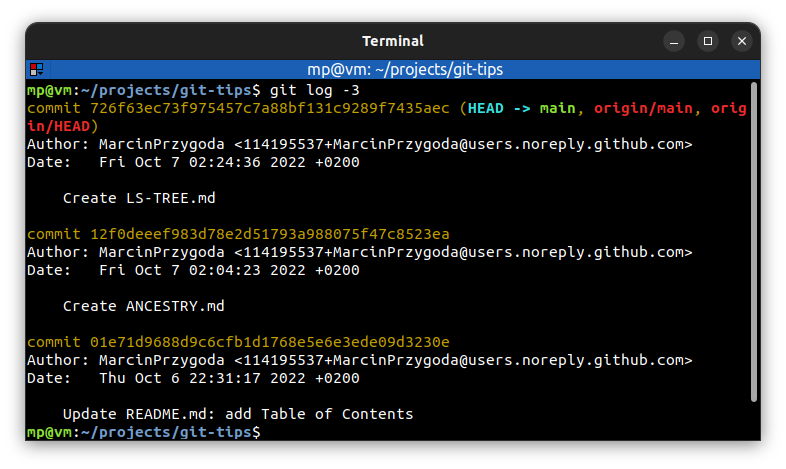

### Show commits after given date

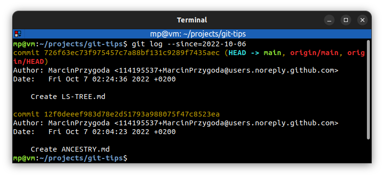

### Show commits before given date

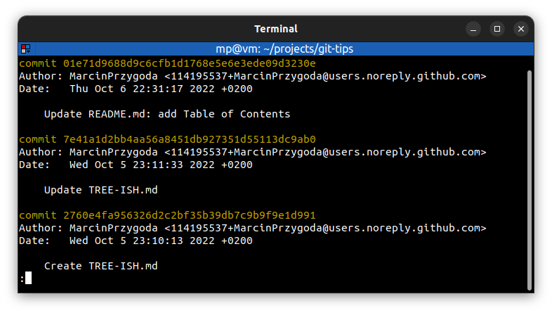

### Show commits done by someone

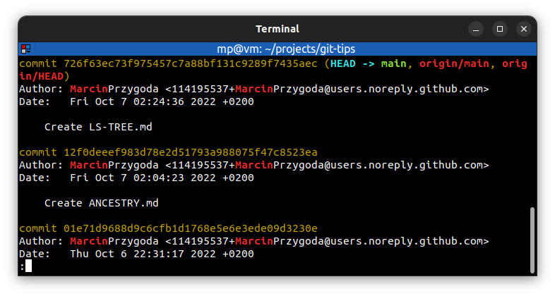

### Show commits that match the specified pattern

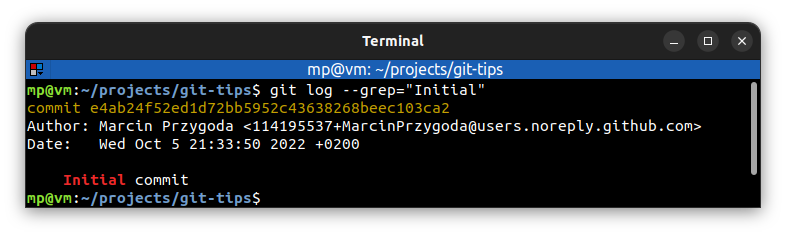

### Show commits in range

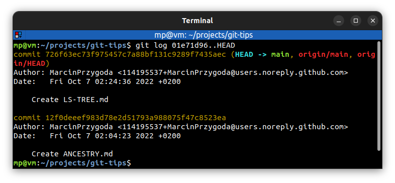

### Show commits related to a file or directory

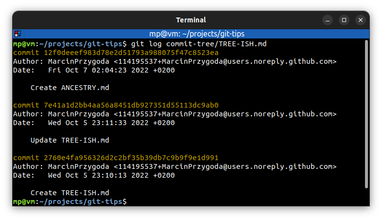

### Show commits with a patch (changelist) information

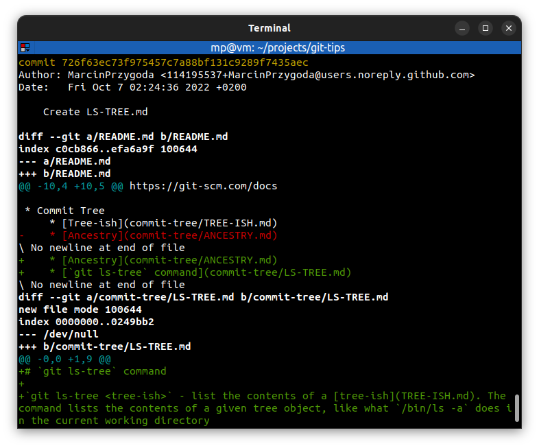

### Show commits statistics

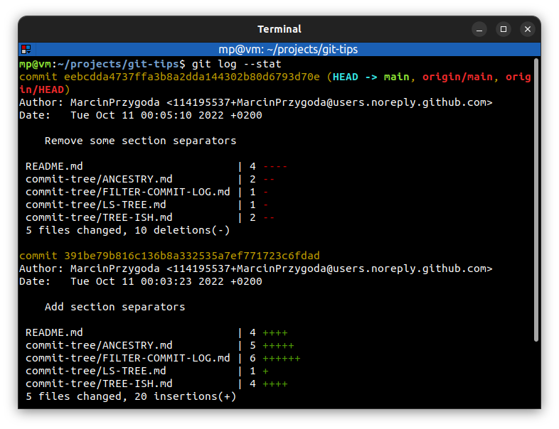

### Show commits in different format

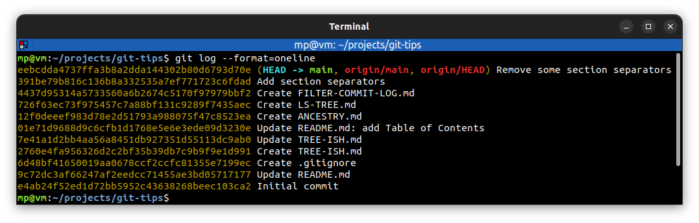

### Show commits in one line with shorter SHA-1 hash

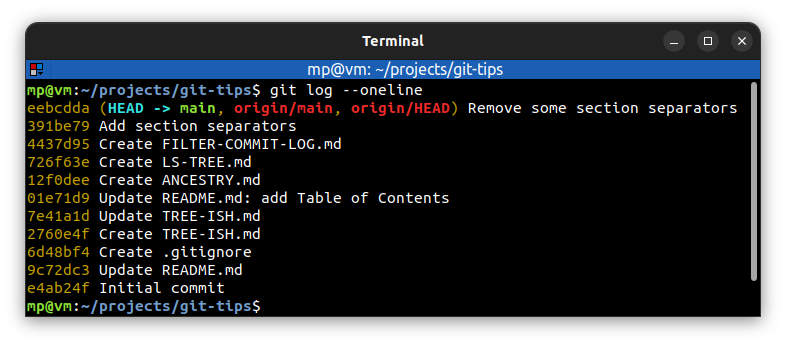

### Show commits graph

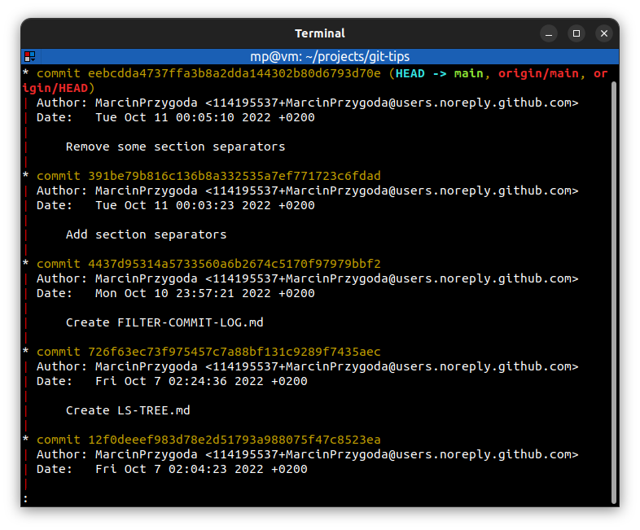

### Show commits graph of all branches in one line with decoration

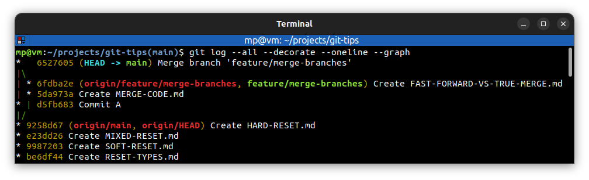