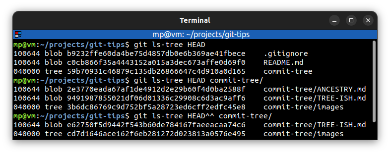

# 📋 `git ls-tree`

The `git ls-tree` command is a good way to go back and **examine the state of a project at a previous moment in time**.

| COMMAND                  | DESCRIPTION                                                                                                                                                                  |
| ------------------------ | ---------------------------------------------------------------------------------------------------------------------------------------------------------------------------- |
| `git ls-tree <tree-ish>` | list the contents of a [tree-ish](../terms/TREE-ISH.md). The command lists the contents of a given tree object, like what `/bin/ls -a` does in the current working directory |

## 📌 Example

- **Tree** is a **directory**
- **Blob** (binary large object) is a **file**

