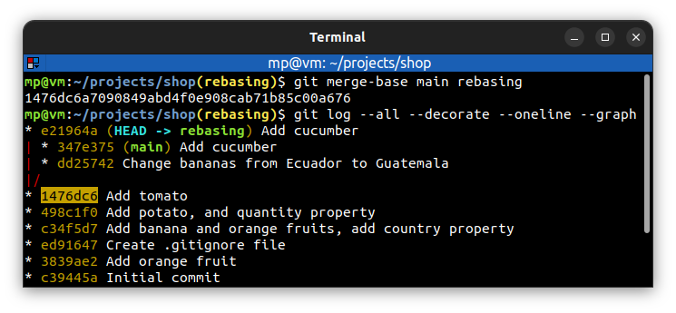

# 📋 `git merge-base` - find as good common ancestors as possible for a merge

| COMMAND                            | DESCRIPTION                              |
| ---------------------------------- | ---------------------------------------- |
| `git merge-base <branch> <branch>` | return commit where two branches diverge |

## 📌 Example

