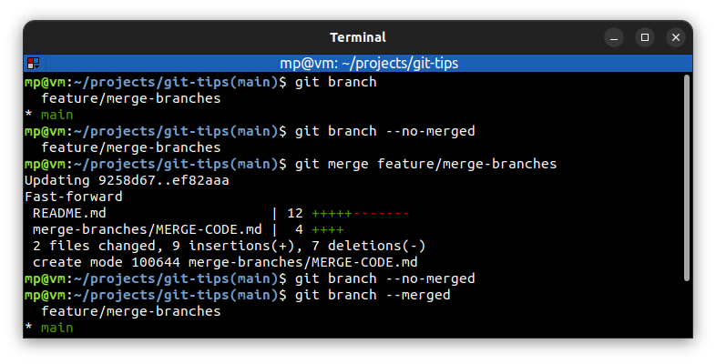
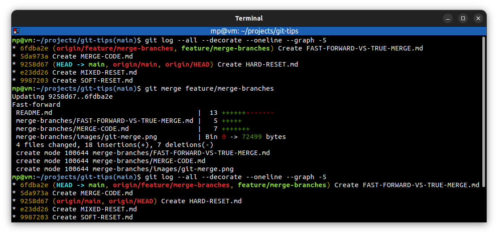
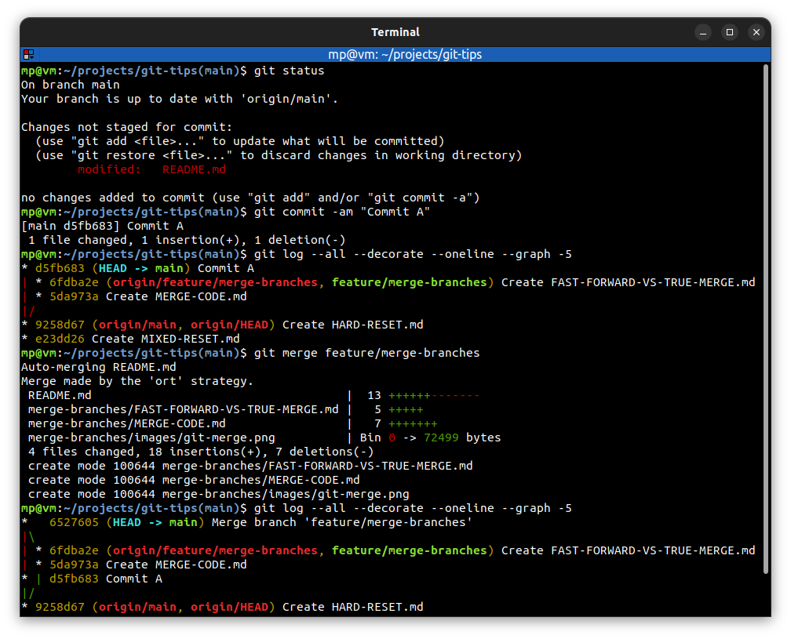
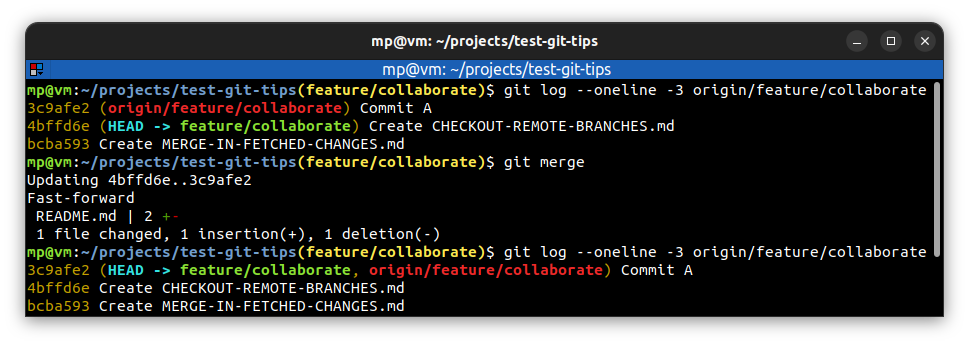

# 📋 `git merge` - join two or more development histories together

| COMMAND                       | DESCRIPTION                                                                                                        |
| ----------------------------- | ------------------------------------------------------------------------------------------------------------------ |
| `git merge <branch>`          | merge changes from `<branch>` into current local branch [🔗](#merge-branch)                                         |
| `git merge <tracking-branch>` | merge changes from `<tracking-branch>` into current local branch                                                   |
| `git merge`                   | when remote branch is tracked, you don't have to specify `<tracking-branch>` parameter [🔗](#merge-tracking-branch) |

## 📌 Fast-forward vs true merge

**Fast-forward merge** does not make a new commit to merge things together. Git just simply **move** commits into the current branch [🔗](#fast-forward-merge)

**True merge** (or **non-fast-forward merge**) makes a new commit which joins two branches together. It is done, when one or more commits are done on current branch, but they're not present on merged branch [🔗](#true-merge)

Most of the time you'll **let git handle merge process** and decide whether it should be a fast-forward or non-fast-forward merge.

## 📌 Conflicts when merging

See [Merge conflicts](../concepts/MERGE-CONFLICTS.md)

## 📌 Merge vs Rebase

See [Merge vs Rebase](../concepts/MERGE-VS-REBASE.md)

## 📌 Example

### Merge branch

### Fast-forward merge

### True merge

### Merge tracking branch

