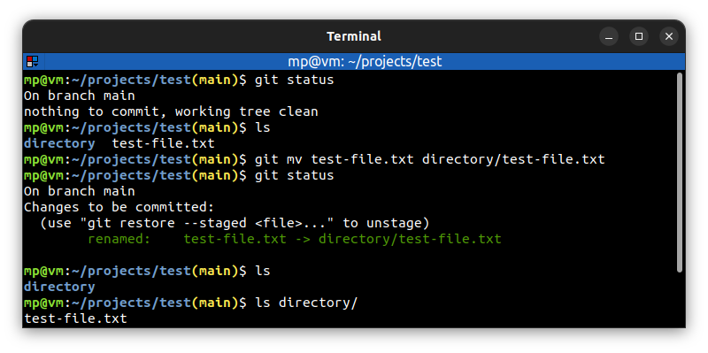
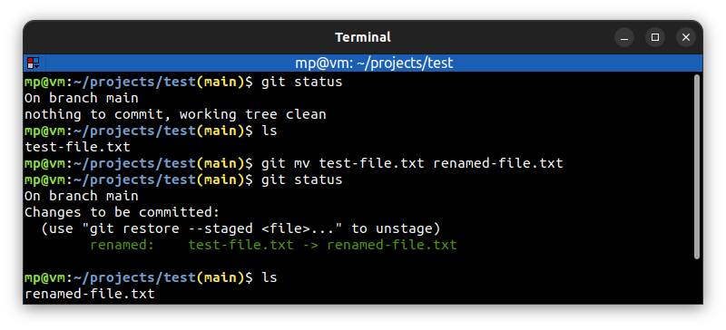

# 📋 `git mv` - move or rename a file, a directory or a symlink

| COMMAND                         | DESCRIPTION                                     |
| ------------------------------- | ----------------------------------------------- |
| `git mv <source> <destination>` | move or rename a file, a directory or a symlink |

## 📌 Example

### Move a file

### Rename a file

