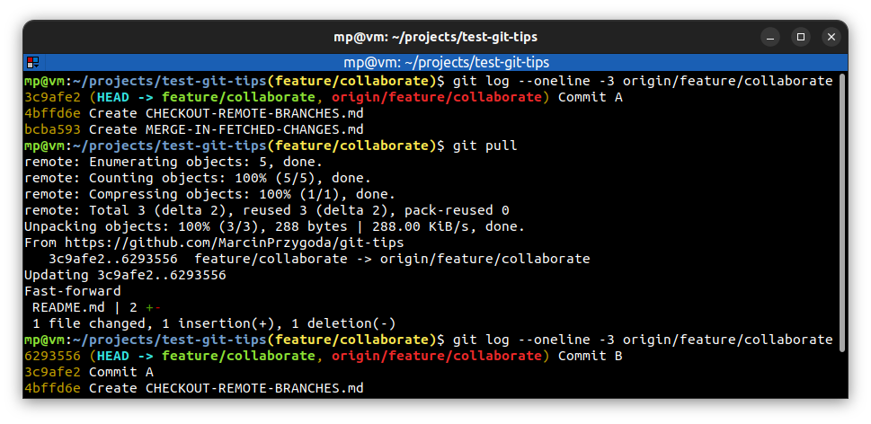

# 📋 `git pull` - fetch from and integrate with another repository or a local branch

| COMMAND    | DESCRIPTION                                         |
| ---------- | --------------------------------------------------- |
| `git pull` | it is two-step operation: `git fetch` + `git merge` |

## 📌 Example

