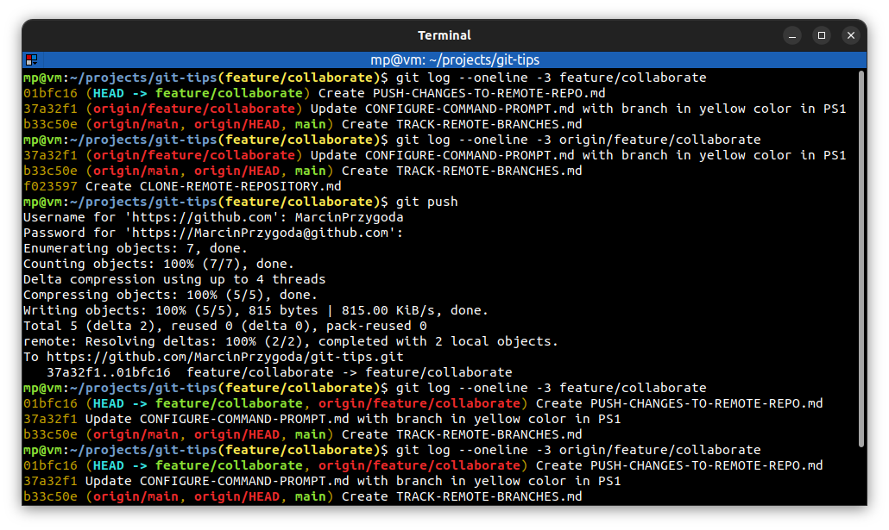
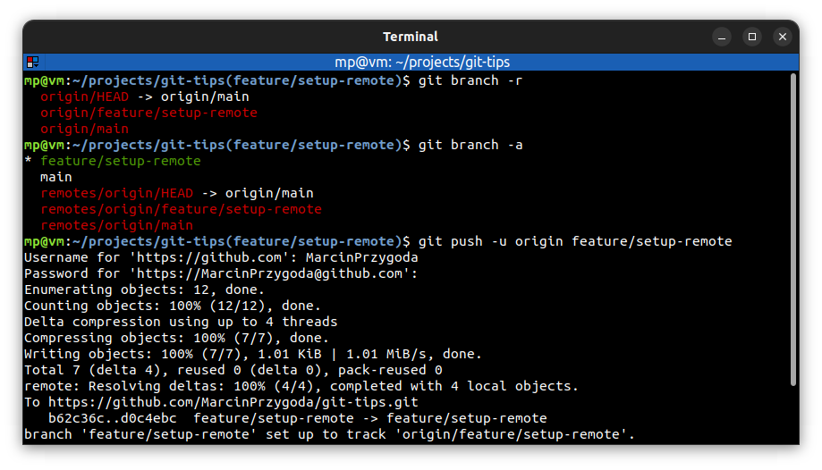
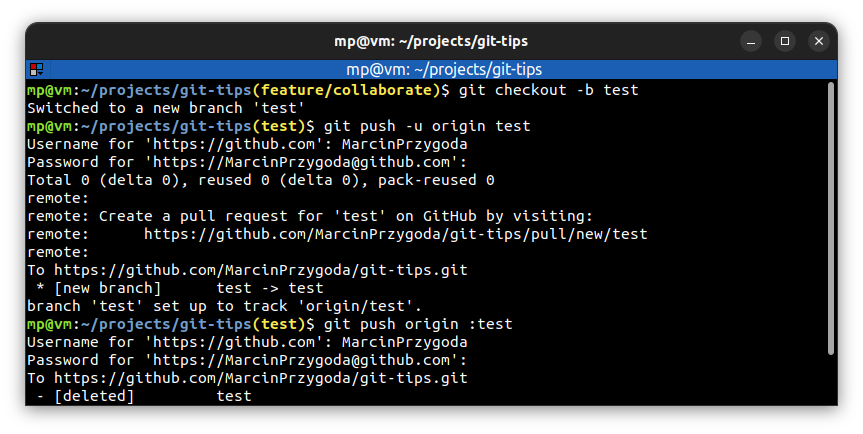
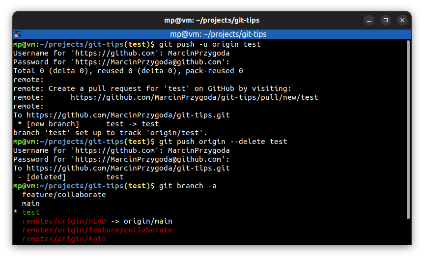

# 📋 `git push`

| COMMAND                             | DESCRIPTION                                                                                                                                                                                                                                                                                                      |
| ----------------------------------- | ---------------------------------------------------------------------------------------------------------------------------------------------------------------------------------------------------------------------------------------------------------------------------------------------------------------- |
| `git push <repository> <branch>`    | push committed changes on `<branch>` into remote `<repository>`. The `-u` option is not needed when remote branch is already tracked                                                                                                                                                                             |
| `git push`                          | when remote branch is tracked, you don't have to specify `<repository>` and `<branch>` parameters [🔗](#push-committed-changes-on-branch-into-remote-repository)                                                                                                                                                  |
| `git push -u <repository> <branch>` | pushes committed changes on `<branch>` into remote `<repository>`. Use `-u` option to add upstream ([**tracking**](../terms/TRACK-REMOTE-BRANCHES.md)) reference, especially when you're creating a `<branch>` for the first time [🔗](#push-committed-changes-on-branch-into-remote-repository-and-add-upstream) |
| `git push origin :<branch>`         | delete remote branch (local branch is not deleted). Regular push is doing `<branch>:<branch>` which is like "push `<branch>` to `<branch>`" The `:<branch>` is like "push nothing to `<branch>`". It's old style way [🔗](#delete-remote-branch-old-style-way)                                                    |
| `git push origin --delete <branch>` | improved way of deleting remote branch [🔗](#delete-remote-branch)                                                                                                                                                                                                                                                |

## 📌 Example

### Push committed changes on branch into remote repository

### Push committed changes on branch into remote repository and add upstream

### Delete remote branch (old style way)

### Delete remote branch

