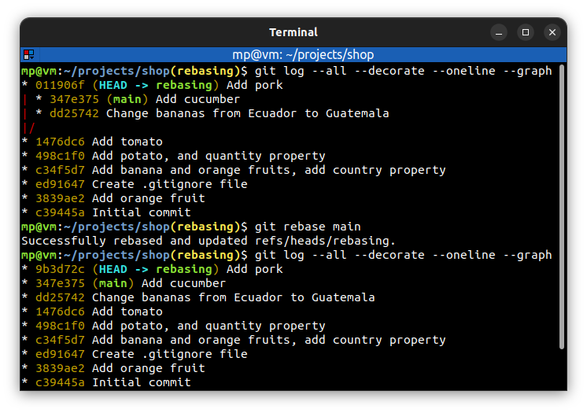

# 📋 `git rebase` - reapply commits on top of another base tip

Rebasing means that we **take commits** from **branch** and **replay them** at the end of **another branch**. It is useful to integrate recent commits **without merging**. It maintains a **cleaner**, more **liner project history**.

| COMMAND                             | DESCRIPTION                                                                 |
| ----------------------------------- | --------------------------------------------------------------------------- |
| `git rebase <base-branch>`          | rebase current branch to tip of `<base-branch>` [🔗](#rebase-current-branch) |
| `git rebase <base-branch> <branch>` | rebase `<branch>` to tip of `<base-branch>`                                 |

## 📌 Example

### Rebase current branch

