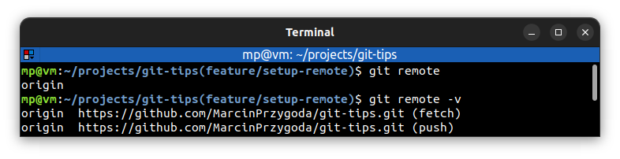

# 📋 `git remote`

| COMMAND                       | DESCRIPTION                                                                  |
| ----------------------------- | ---------------------------------------------------------------------------- |
| `git remote`                  | show a list of existing remotes                                              |
| `git remote -v`               | show a list of existing remotes and remote url after name                    |
| `git remote add <name> <url>` | add a remote named `<name>` (usually `origin`) for the repository at `<url>` |
| `git remote remove <name>`    | remove the remote named `<name>`                                             |

## 📌 Example

