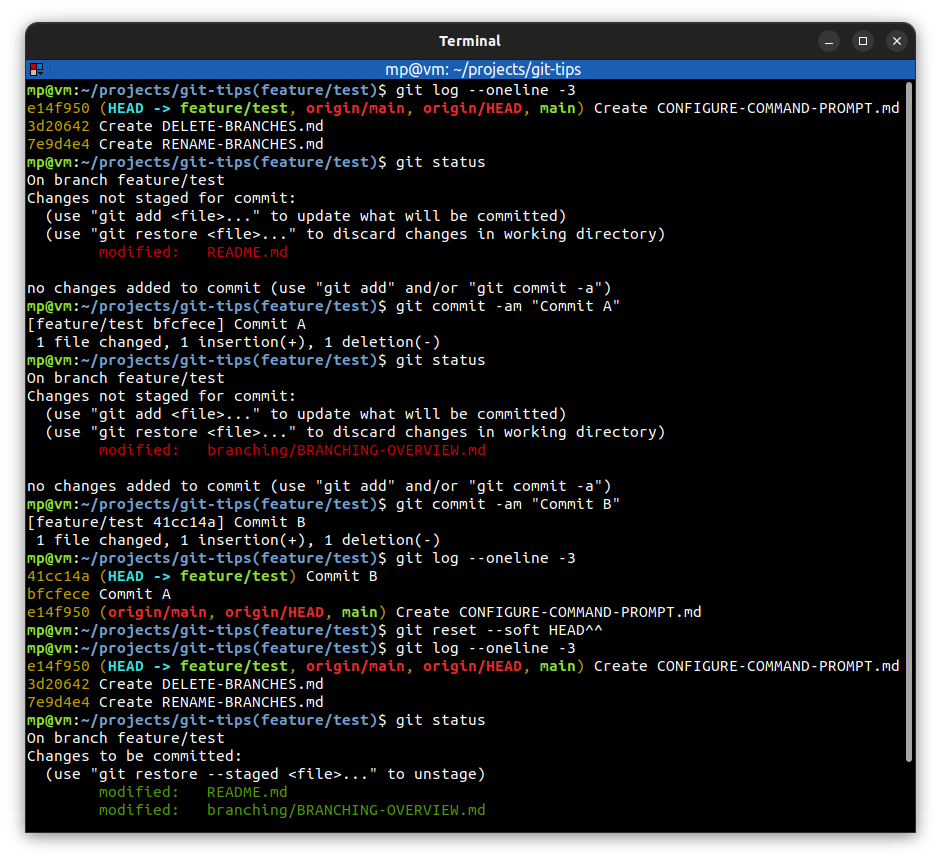
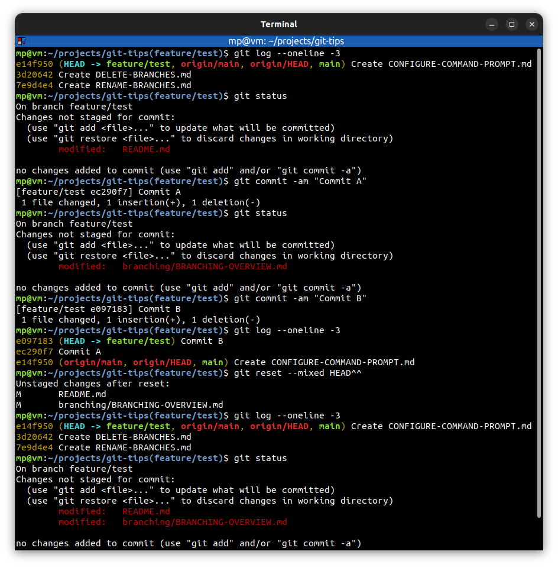
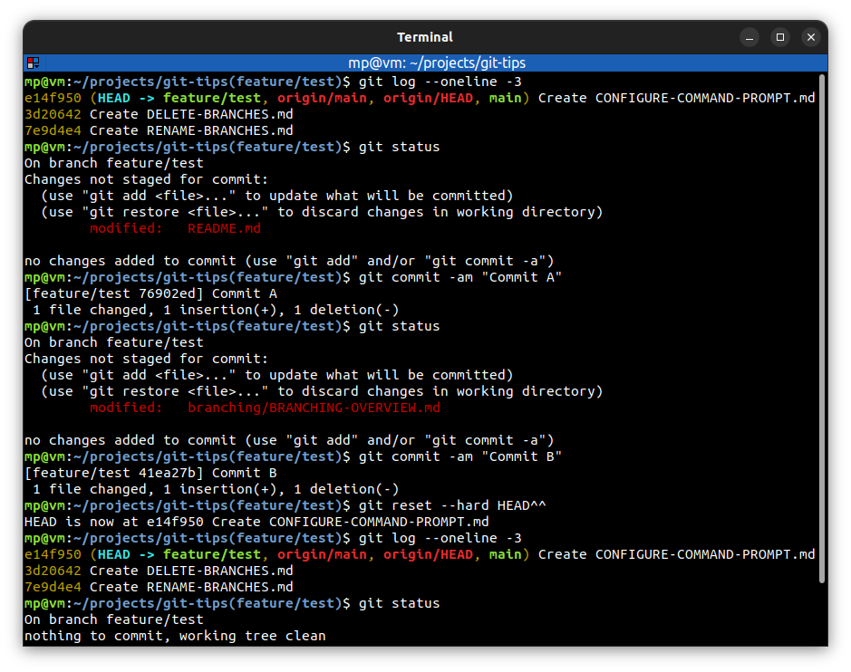
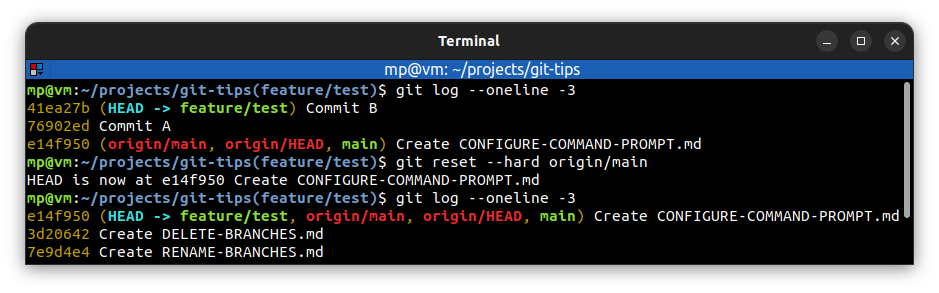
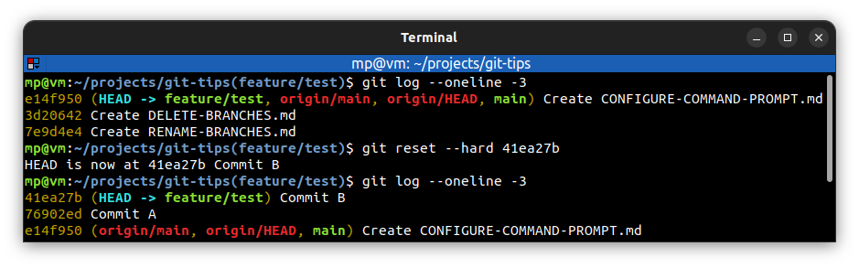

# 📋 `git reset`

**Reset** changes the files in the **staging index** and/or **working directory** to the state they had when a **specified commit was made**. It moves **HEAD** pointer to a **specific commit**.

> "Make my project look like it did back then"

Most of the time you only want to do resets, when you're working in **your own private repository** and you have not pushed those changes to **any remote repository** or shared it with **any collaborators**.

## 📌 Types of reset

| COMMAND                        | DESCRIPTION                           |
| ------------------------------ | ------------------------------------- |
| `git reset --soft <tree-ish>`  | perform soft reset [🔗](#soft-reset)   |
| `git reset --mixed <tree-ish>` | perform mixed reset [🔗](#mixed-reset) |
| `git reset --hard <tree-ish>`  | perform hard reset [🔗](#hard-reset)   |

- **soft**:
  - moves HEAD pointer
  - does not change staging index
  - does not change working directory
- **mixed** (this is **default** option for `git reset`):
  - moves HEAD pointer
  - changes staging index to match repository
  - does not change working directory
- **hard**:
  - moves HEAD pointer
  - changes staging index to match repository
  - changes working directory to match repository

## 📌 Soft reset

- used to return to an old state and leave code changes **staged**
- useful for **amending** one or more commits
- similar to `git commit --amend`
- previous commits will be **discarded**
- be careful about amending commits which have been **shared with others**

## 📌 Mixed reset

- used to return to an old state and leave code changes **in working directory**
- useful for **reorganizing** commits
- previous commits will be **discarded**
- be careful about amending commits which have been **shared with others**

## 📌 Hard reset

- used to return to an old state and **discard** all code changes
- useful to **permanently undo** commits e.g. when you want to make one branch look like another [🔗](#hard-reset-to-branch)
- previous commits and all changes will be **discarded**
- be careful about amending commits which have been **shared with others**

## 📌 Undo reset

| COMMAND                   | DESCRIPTION                                                                                                                                                                                                                                |
| ------------------------- | ------------------------------------------------------------------------------------------------------------------------------------------------------------------------------------------------------------------------------------------ |
| `git reset <commit-hash>` | undo `git reset` command: you can do it in **short term**. When we do a reset and there's nothing pointing at those commits that are later on, then git feels like it's able to delete them during **garbage collection** [🔗](#undo-reset) |

## 📌 Example

### Soft reset

### Mixed reset

### Hard reset

### Hard reset to branch

### Undo reset

