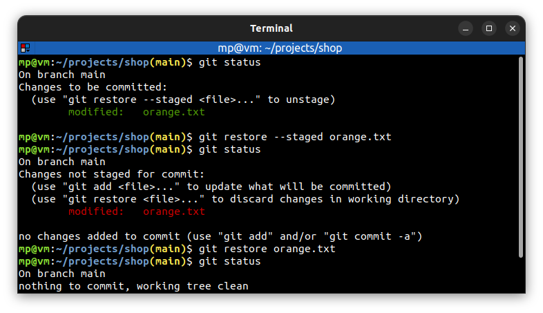

# 📋 `git restore` - restore working directory files

| COMMAND                                                                        | DESCRIPTION                       |
| ------------------------------------------------------------------------------ | --------------------------------- |
| `git restore <file>...`                                                        | undo changes in files             |
| `git restore --staged <file>...` `git restore -S <file>...`               | unstage files                     |
| `git restore --staged --worktree <file>...` `git restore -S -W <file>...` | unstage and undo changes in files |

📌 Example

