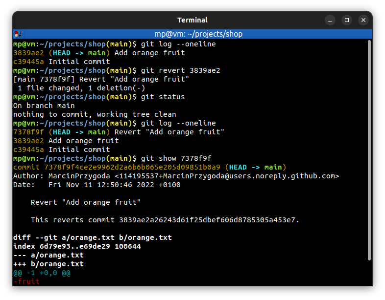
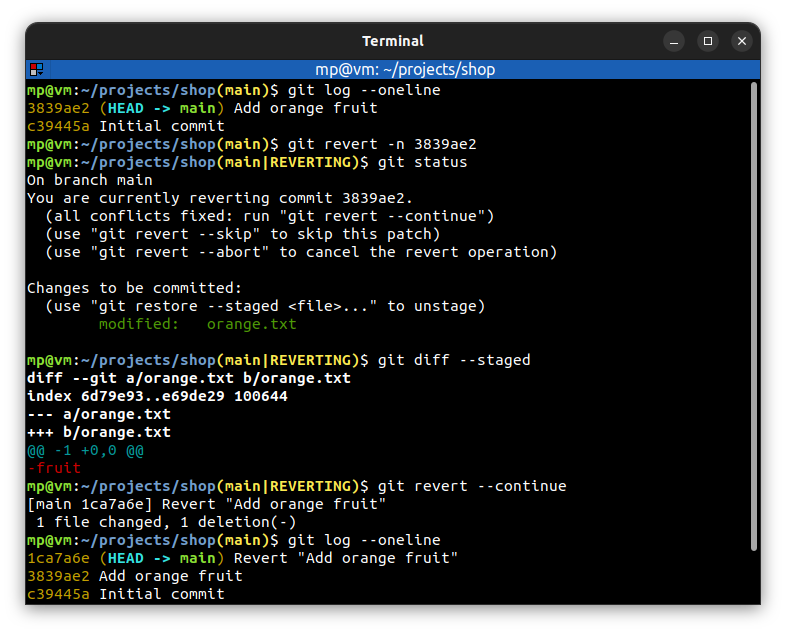

# 📋 `git revert` - revert some existing commits

| COMMAND                                                               | DESCRIPTION                                                                                                                                                 |
| --------------------------------------------------------------------- | ----------------------------------------------------------------------------------------------------------------------------------------------------------- |
| `git revert <commit>...`                                              | given one or more existing commits, revert the changes that the related patches introduce, and record some new commits that record them [🔗](#revert-commit) |
| `git revert -n <commit>...` `git revert --no-commit <commit>...` | does not create a revert commit. Revert commit is created after `git revert --continue` command [🔗](#revert-commit-with-no-commit)                          |

## 📌 Examples

### Revert commit

### Revert commit with no commit

