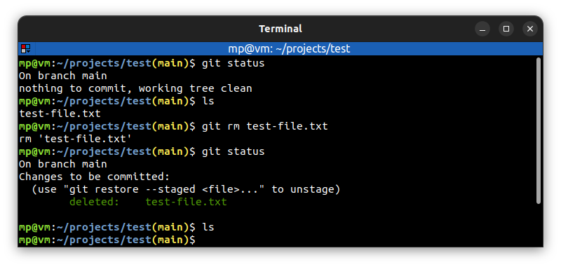

# 📋 `git rm` - remove files from the working directory and from the staging index

| COMMAND             | DESCRIPTION                                                                                           |
| ------------------- | ----------------------------------------------------------------------------------------------------- |
| `git rm <pathspec>` | remove files matching pathspec from the staging index, or from the working directory and the staging index |

## 📌 Example

