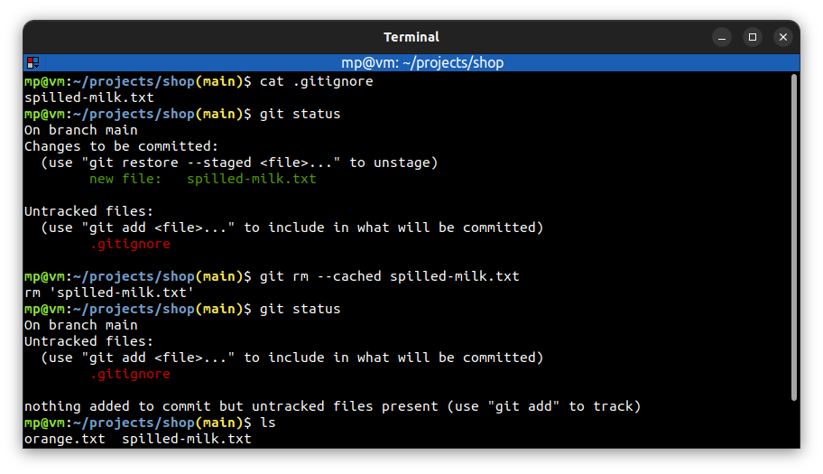

# 📋 `git rm` - remove files from the working directory and from the staging index

| COMMAND                     | DESCRIPTION                                                                                                                                                         |
| --------------------------- | ------------------------------------------------------------------------------------------------------------------------------------------------------------------- |
| `git rm <file>...`          | remove files from the working directory and from the staging index [🔗](#remove-file-from-the-working-directory-and-the-staging-index)                                    |
| `git rm --cached <file>...` | remove files from the staging index (useful for unstaging already [ignored](../concepts/GIT-IGNORE.md), but still tracked files) [🔗](#unstage-already-ignored-file) |

## 📌 Examples

## Remove file from the working directory and the staging index

## Unstage already ignored file

