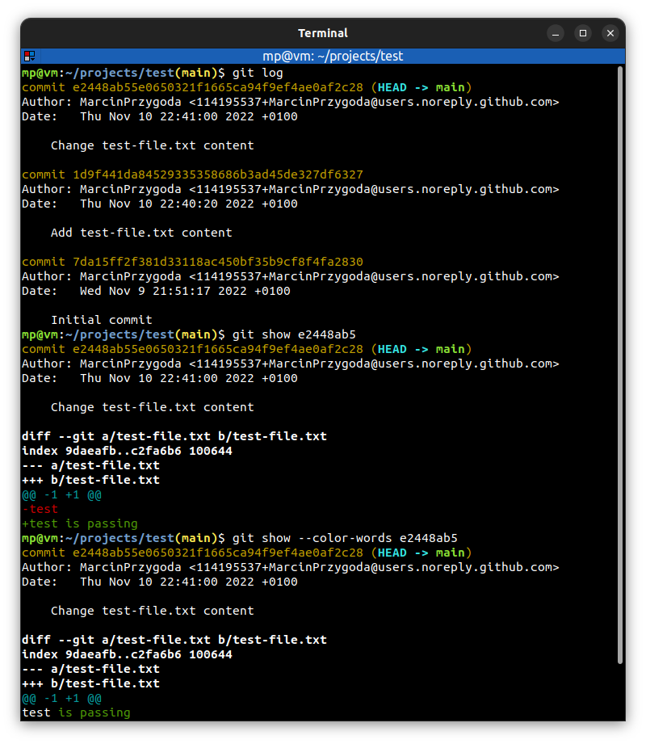

# 📋 `git show` - show various types of objects

| COMMAND                             | DESCRIPTION                                                                           |
| ----------------------------------- | ------------------------------------------------------------------------------------- |
| `git show <tree-ish>`               | show various types of objects. For commits, it shows the log message and textual diff |
| `git show --color-words <tree-ish>` | **highlight changed words** using only colors (there are no `+`/`-`)                  |

## 📌 Example

