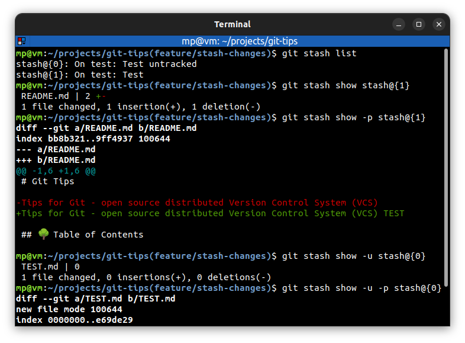
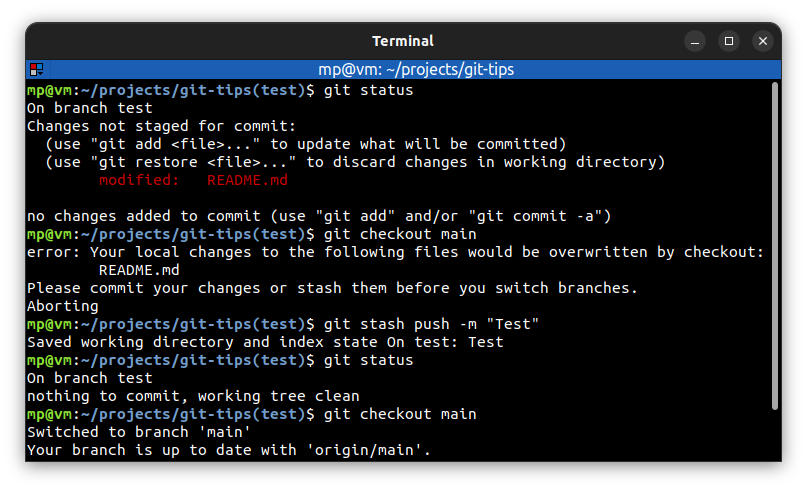
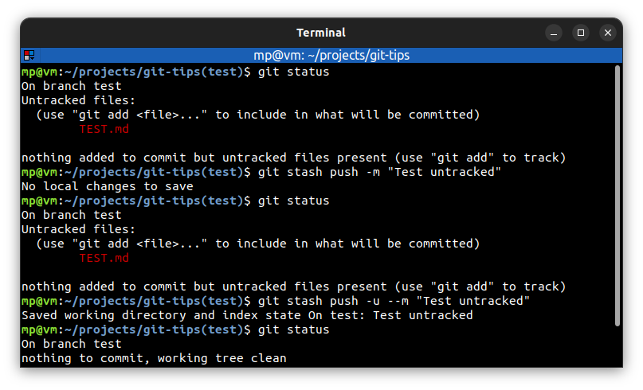
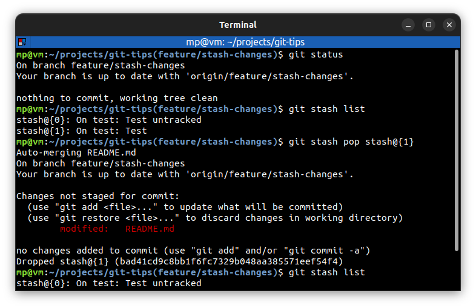
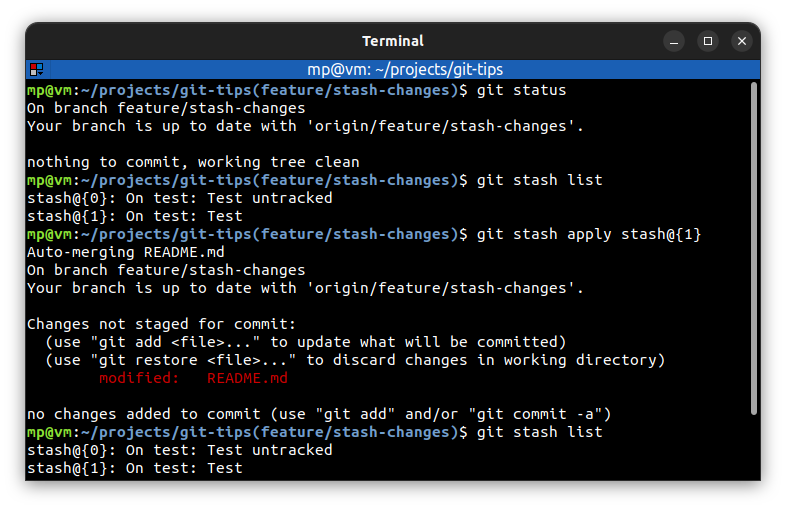
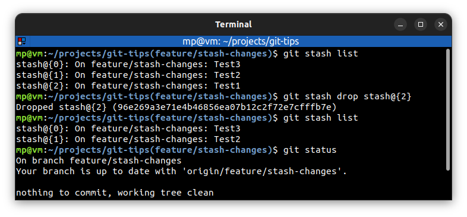
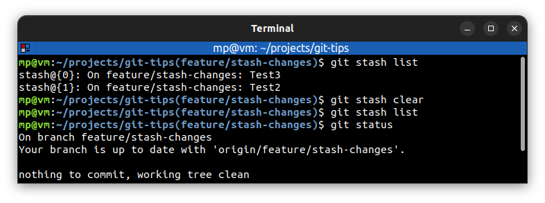

# 📋 `git stash` - stash the changes in a dirty working directory away

Stashes are like a **little pocket** where you can put the changes and pull them out when you're ready.

The stash is not part of the repository, the staging index or the working directory. It's a special fourth area of Git, **separate from others**.

Changes in the stash are **independent of the branches** that you're on. It means that stashes are available on all of the branches.

| COMMAND                          | DESCRIPTION                                                                                                                                                                                        |
| -------------------------------- | -------------------------------------------------------------------------------------------------------------------------------------------------------------------------------------------------- |
| `git stash list`                 | list stash entries that you currently have [🔗](#list-stash-entries)                                                                                                                                |
| `git stash show stash@{1}`       | show the changes recorded in the stash entry                                                                                                                                                       |
| `git stash show -p stash@{1}`    | show the changes recorded in the stash entry as a patch (actual changes)                                                                                                                           |
| `git stash show -u stash@{0}`    | show the changes recorded in the stash entry including untracked files                                                                                                                             |
| `git stash push -m <message>`    | save changes in the stash [🔗](#save-changes-in-the-stash)                                                                                                                                          |
| `git stash push -u -m <message>` | save changes in the stash including untracked files [🔗](#save-changes-in-the-stash-including-untracked-files)                                                                                      |
| `git stash pop stash@{1}`        | **remove** a single stashed state from the stash list and **apply** it on top of the current working tree state, i.e., do the inverse operation of git stash push [🔗](#pop-changes-from-the-stash) |
| `git stash apply stash@{1}`      | like `pop`, but **does not remove** the state from the stash list [🔗](#apply-changes-from-the-stash)                                                                                               |
| `git stash drop stash@{0}`       | **remove a single stash entry** from the list of stash entries [🔗](#remove-stash-entry)                                                                                                            |
| `git stash clear`                | **remove all** the stash entries [🔗](#clear-all-stash-entries)                                                                                                                                     |

## 📌 Conflicts when popping/applying changes

When you `pop` or `apply` changes out of your stash back into your working directory, it's possible for it to **have conflicts**. And if you do have conflicts, it will work just like a `merge` does.

## 📌 Example

### List stash entries

### Save changes in the stash

### Save changes in the stash including untracked files

### Pop changes from the stash

### Apply changes from the stash

### Remove stash entry

### Clear all stash entries

