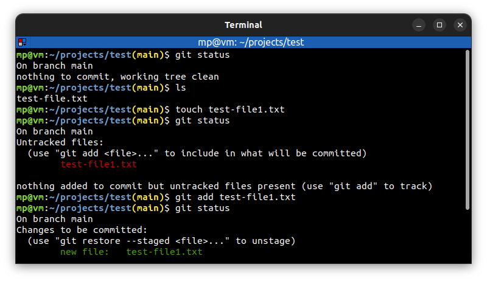

# 📋 `git status` - show the working tree status

| COMMAND      | DESCRIPTION                  |
| ------------ | ---------------------------- |
| `git status` | show the working tree status |

## 📌 Example

