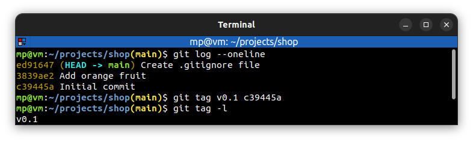
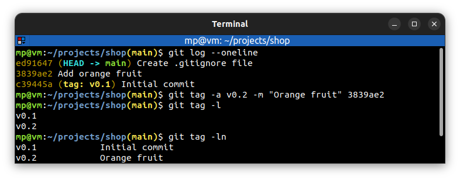
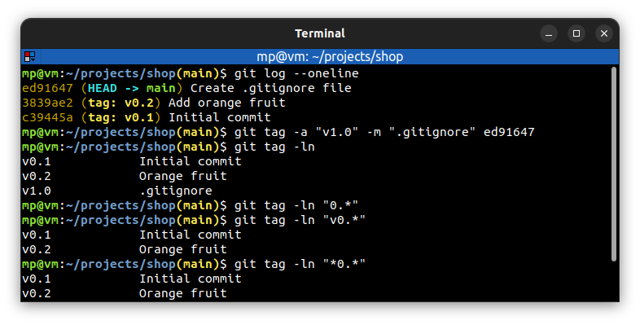

# 📋 `git tag` - create, list, delete or verify a tag object signed with GPG

Tags:
- are a **named reference** to a commit to make it easy to find that commit in future
- allow **marking points in history as important**
- most often are used to **mark releases** (e.g. `v1.0`, `v1.1`, `v2.0`)
- can **mark key features or changes** (e.g. `ecommerce`, `redesign`)
- can **mark points for team discussions** (e.g. `bug`, `issue123`)

| COMMAND                                            | DESCRIPTION                                                                                                                                               |
| -------------------------------------------------- | --------------------------------------------------------------------------------------------------------------------------------------------------------- |
| `git tag <lightweight-tag> <commit>`               | create lightweight tag [🔗](#create-and-list-lightweight-tag)                                                                                              |
| `git tag -a <annotated-tag> -m <message> <commit>` | create annotated tag (most common, it contains message) [🔗](#create-and-list-annotated-tag)                                                               |
| `git tag -l` `git tag --list`                 | list tags [🔗](#create-and-list-lightweight-tag)                                                                                                           |
| `git tag -l "*.0"`                                 | list tags which end with `.0`. The `*` is a wildcard character [🔗](#list-tags-with-wildcard-character)                                                    |
| `git tag -ln`                                      | list tags with first line of annotation message. If the tag is not annotated, the commit message is displayed instead [🔗](#create-and-list-annotated-tag) |
| `git tag -d <tag>` `git tag --delete <tag>`   | delete tag [🔗](#delete-tag)                                                                                                                               |

## 📌 Lightweight vs annotated tags

Tag objects (created with `-a`, `-s`, or `-u`) are called "**annotated**" tags. They contain a **creation date**, the t**agger name** and **e-mail**, a **tagging message**, and an **optional GnuPG signature**. Whereas a "**lightweight**" tag is **simply a name** for an object (usually a commit object).

Annotated tags are meant for **release** while lightweight tags are meant for **private or temporary object labels**. For this reason, some git commands for naming objects (like `git describe`) will **ignore** lightweight tags by default.

## 📌 Create tags

If we were to **omit** SHA-1 hash of commit at the very end of `git tag` command, then git would use the **current** `HEAD` by default.

## 📌 Push and fetch tags

Like branches, tags are local unless shared to a remote. The `git push` command **does not push tags** by default. Tags must be **explicitly pushed** with: [`git tag <repository> <tag>`](GIT-PUSH.md).

On the other hand, the [`git fetch`](GIT-FETCH.md) command **automatically fetches** shared tags.

## 📌 Checking out tags

Tags **are not branches**. Tags can be checked out, just like any commit.

The **right way** to checkout a tag is to create a branch from it: [`git checkout -b <branch> <tag>`](GIT-CHECKOUT.md).

It's also possible to just checkout the tag: [`git checkout <tag>`](GIT-CHECKOUT.md), but be careful with making new commits as you can end with [detached HEAD state](../concepts/DETACHED-HEAD-STATE.md).

## 📌 Examples

### Create and list lightweight tag

### Create and list annotated tag

### List tags with wildcard character

### Delete tag

